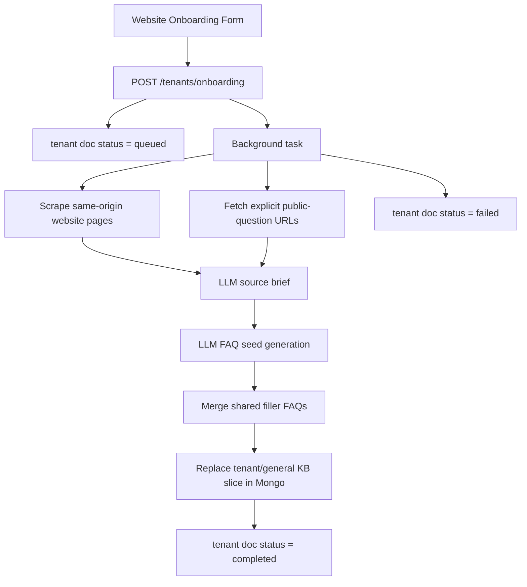

# Onboarding And Seed Generation Architecture

## Purpose

This document describes the tenant onboarding pipeline that turns a tenant website and brand voice into an initial Mongo knowledge base.

It is designed for:

- website-form onboarding
- tenant-specific brand voice capture
- website scraping
- optional public-question enrichment
- LLM-based FAQ seed generation
- automatic Mongo KB seeding

## Current Entry Points

### `POST /tenants/onboarding`

Queues a tenant onboarding run.

Request shape:

- `tenantId`
- `websiteUrl`
- `brandVoice`
- optional `tenantName`
- optional `tags`
- optional `publicQuestionUrls`
- optional `targetFaqCount`

Immediate behavior:

- upserts the tenant document with `websiteUrl`, `brandVoice`, and onboarding status `queued`
- launches a background onboarding task
- returns `202 Accepted`

### `GET /tenants/{tenantId}/onboarding-status`

Reads the current onboarding state from the tenant document.

Returns:

- `tenantId`
- `websiteUrl`
- `brandVoice`
- `onboarding`
- `updatedAt`

## Runtime Flow

## Main Files

### Runtime

- [onboarding.py](C:/Users/pranav%20h/Documents/GitHub/SVMP-CS/svmp-core/svmp_core/routes/onboarding.py)
  HTTP route surface
- [onboarding.py](C:/Users/pranav%20h/Documents/GitHub/SVMP-CS/svmp-core/svmp_core/core/onboarding.py)
  scraping, prompt-building, FAQ generation, and persistence orchestration
- [onboarding.py](C:/Users/pranav%20h/Documents/GitHub/SVMP-CS/svmp-core/svmp_core/models/onboarding.py)
  onboarding request/response models
- [mongo.py](C:/Users/pranav%20h/Documents/GitHub/SVMP-CS/svmp-core/svmp_core/db/mongo.py)
  tenant upsert and KB replace persistence methods

### Supporting config/data

- [config.py](C:/Users/pranav%20h/Documents/GitHub/SVMP-CS/svmp-core/svmp_core/config.py)
  onboarding scrape and generation settings
- [sample_tenant.json](C:/Users/pranav%20h/Documents/GitHub/SVMP-CS/scripts/demo_data/sample_tenant.json)
  example tenant with `brandVoice`
- [seed_tenant.py](C:/Users/pranav%20h/Documents/GitHub/SVMP-CS/scripts/seed_tenant.py)
  tenant seed format now accepts `brandVoice`

## Tenant Document Fields

The onboarding flow writes these tenant-level fields:

- `tenantId`
- `tenantName`
- `websiteUrl`
- `brandVoice`
- `tags`
- `domains`
- `updatedAt`
- `onboarding`

### `onboarding`

Current stored status block includes:

- `status`
  `queued`, `processing`, `completed`, or `failed`
- `startedAt`
- `completedAt`
- `lastError`
- `targetFaqCount`
- `generatedFaqCountBeforeShared`
- `generatedFaqCount`
- `sharedSeedCount`
- `seededDomainId`
- `sourceWebsiteUrl`
- `sourcePageCount`
- `publicQuestionUrls`
- `publicQuestionSourceCount`

## Scraping Model

### Website crawl

The crawler currently:

- normalizes the submitted `websiteUrl`
- fetches the root page
- follows same-origin links only
- limits crawl depth by page count instead of sitemap breadth
- extracts:
  - page title
  - meta description
  - heading text
  - paragraph and list text

This is intentionally conservative so onboarding stays deterministic and bounded.

### Public-question enrichment

The current implementation supports explicit URLs only.

That means the caller can pass links such as:

- Reddit discussion URLs
- Quora question URLs
- forum pages
- community threads

The system fetches those URLs as additional input documents, but it does not yet do automatic external discovery through search.

## LLM Stages

The pipeline uses two LLM stages.

### Stage 1: source brief

Inputs:

- scraped website pages
- scraped public-question pages
- tenant brand voice
- target FAQ count

Output:

- company summary
- factual highlights
- customer concerns
- FAQ angles

Purpose:

- compress large scraped input into a smaller factual intermediate representation

### Stage 2: FAQ generation

Inputs:

- tenant id
- website URL
- tenant brand voice
- target FAQ count
- source brief

Output:

- JSON FAQ list with:
  - `question`
  - `answer`
  - `tags`

Purpose:

- generate a broad, practical first-line support FAQ seed

## Knowledge Base Seeding Strategy

Generated FAQs are converted into `KnowledgeEntry` models and written into Mongo.

Current behavior:

- target domain is `general`
- existing tenant/general slice is replaced
- website-generated FAQs are merged with the shared filler FAQ seed during onboarding
- generated entries receive tags such as:
  - `autogenerated`
  - `website_onboarding`
  - `shared_seed` for materialized shared entries

This means onboarding currently acts as a clean re-seed of the general domain instead of an append-only merge.

## Answering Integration

The onboarding flow is connected to the live answering path in two ways:

- `brandVoice` is stored on the tenant doc
- Workflow B now reads tenant `brandVoice` and rewrites matched FAQ answers into tenant voice before sending

That makes onboarding useful immediately even before future improvements to scrape quality.

## Current Limitations

- onboarding runs in an in-process background task, not a persistent queue
- generated FAQs are written only to the `general` domain
- public-question enrichment requires explicit URLs
- there is no deduplicated source-store collection yet
- there is no human review gate before KB publish
- there is no embedding/index refresh stage beyond the existing Mongo FAQ write

## Recommended Next Steps

1. Add a persistent onboarding job collection so work survives restarts.
2. Add automatic domain synthesis instead of writing everything into `general`.
3. Add source provenance storage per FAQ.
4. Add external source discovery adapters for Reddit, Quora, and search-backed discovery where legally and operationally appropriate.
5. Add a review/publish state so generated FAQs can be approved before going live.
