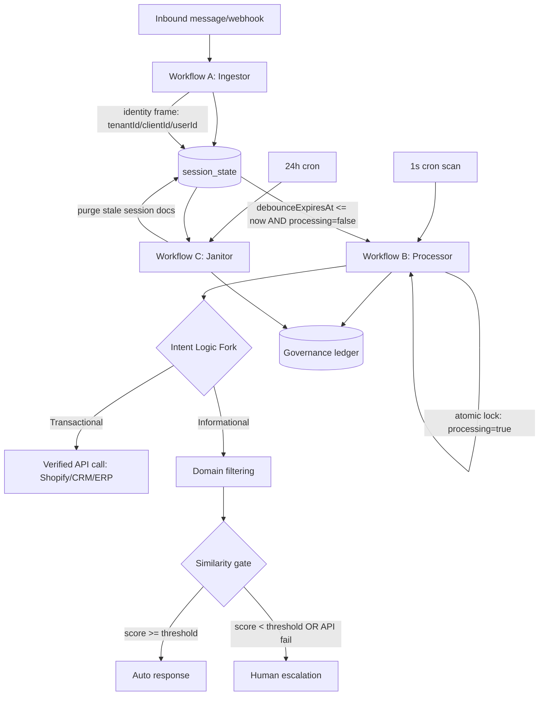
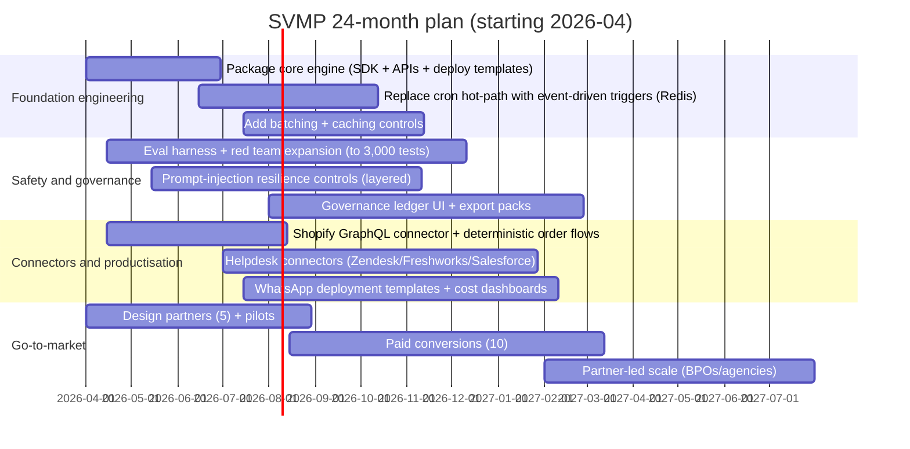

# v4.1: Moat and Commercialisation Assessment

## Executive summary

A product like SVMP—positioned as a **state-aware, multi-tenant governance + orchestration layer** for LLM-powered support automation—targets a real and fast-growing pain: teams want **automation**, but production deployments still struggle with **hallucinations, prompt-injection security, transactional integrity, and unpredictable costs**. The SVMP whitepaper’s core thesis is that LLM reliability requires **state management + deterministic routing + strict tenancy isolation + auditable decision logs**, not just “better prompts”. fileciteturn0file0

Market signals align with this thesis: (a) contact centres and customer service platforms are rapidly adding autonomous “AI agents”, and (b) security guidance is converging on “assume prompt injection exists; reduce blast radius via design”. The **OWASP LLM Top 10** highlights prompt injection as the leading risk class, and the **UK National Cyber Security Centre** argues prompt injection is better treated as an “inherently confusable deputy” problem—pushing architecture-level mitigations over silver bullets. citeturn8search5turn8search0

Commercial viability depends on SVMP choosing the right “wedge” because **full-stack customer support AI is crowded** (major incumbents already bundle AI into their helpdesks). The strongest wedge is not “yet another chatbot”, but **a deployable governance engine** that:  
1) enforces hard multi-tenant isolation (for agencies/BPOs/multi-brand operators),  
2) reduces LLM spend via message aggregation, and  
3) prevents transactional hallucinations via verified API calls, especially in commerce flows (order tracking/cancellation/returns). fileciteturn0file0

**Moat outlook:** defensible moats are possible, but they are more likely to come from **integrations, operational telemetry + evaluation datasets, compliance posture, and ecosystem lock-in** than from model IP. SVMP should assume base LLM capabilities commoditise and design moats accordingly. citeturn0search1turn9search2

**Recommended strategic direction:** an **open-core + hosted SaaS** approach (with carefully chosen licensing) is the best balance of adoption and defensibility for an infrastructure-layer product. Open-source the “engine primitives” to earn trust and adoption; monetise with hosted multi-tenant SaaS, enterprise governance features, compliance tooling, SLAs, and high-value connectors. This is consistent with how open-core companies explain sustainability (e.g., entity["organization","GitLab","devops platform open core"]’s open-core stewardship framing), while also acknowledging cloud-competition realities (e.g., entity["company","Elastic","search company licensing"]’s dual-licensing shift). citeturn17search3turn17search1

## Product and technology assessment

SVMP v4.1 describes a **tri-workflow** architecture:

- **Workflow A (“Ingestor”)**: webhook-triggered ingestion, identity scoping, “soft debounce” aggregation into a single “Complete Thought Unit”, and preparation for exactly-once processing.  
- **Workflow B (“Processor”)**: cron-triggered processing using atomic locks (MUTEX-style), intent logic fork (transactional vs informational), domain filtering, similarity-based governance gate, logging, and escalation on uncertainty.  
- **Workflow C (“Janitor”)**: nightly lifecycle management that purges session state while preserving an append-only governance ledger for auditability. fileciteturn0file0

A key product claim is **cost and reliability improvement** through aggregation: the soft-debounce window (2.5s) merges multi-burst user fragments into a single semantic unit, reducing redundant LLM calls and “hallucination loops”. The whitepaper reports internal pilot/stress-test reductions of **~40–60% LLM overhead** (range presented across sections) and emphasises that the 2.5s window is a validated benchmark, not a guess. fileciteturn0file0

### Architecture map



The **intent bifurcation** is strategically important: SVMP asserts that transactional queries should bypass the LLM and instead call a verified source-of-truth API to eliminate “transactional hallucination”. This aligns with modern agent safety practice: let the model classify/route, but keep side-effecting actions behind deterministic checks and strong permissions. fileciteturn0file0 citeturn8search0

### Tech stack and data dependencies

From the whitepaper, SVMP’s persistence model is centred on **MongoDB collections** for session state, knowledge base, and governance logs, with vector similarity search used for retrieval and scoring. fileciteturn0file0

If SVMP uses entity["company","MongoDB","database company"] Atlas Vector Search (or equivalent), MongoDB supports storing embeddings as fields, creating vector indexes, and executing vector search with optional pre-filtering fields—useful for tenant/domain filtering. MongoDB also publishes multi-tenant architecture guidance that requires a tenant ID field and query filtering by that field. citeturn10search2turn10search3

SVMP’s commerce integration narrative mentions triggering verified calls to platforms like entity["company","Shopify","ecommerce platform"]. Shopify’s own API docs indicate major platform evolution: the REST Admin API is labelled legacy as of Oct 2024, and new public apps must use the GraphQL Admin API from Apr 2025—this matters for SVMP connector design and long-term maintenance. citeturn10search1turn10search12

Human escalation is described as notifying a human agent via channels like entity["company","Slack","work chat platform"]; Slack’s documentation describes incoming webhooks as a mechanism to post messages from external systems. citeturn10search0

SVMP also anticipates an event-driven evolution (e.g., Redis transition, batching, SLMs for intent classification) in its next engineering phase. fileciteturn0file0

### IP assessment

Most SVMP components—debounce aggregation, distributed locking, RAG, similarity thresholds, audit logs—have substantial prior art in distributed systems and LLM application design. The strongest protectable IP is less likely to be patents on broad patterns, and more likely to be:

- proprietary **evaluation harnesses and red-team suites** (SVMP cites hundreds of tests and a plan to scale further),  
- production-grade **reference implementations** tuned for multi-tenant isolation and cost efficiency,  
- accumulated **governance telemetry** and “escalation → resolution” datasets. fileciteturn0file0 citeturn0search0turn9search2

## Target customers, positioning, and market size

### Core customer segments

SVMP is best framed as a **governed automation engine** rather than a branded chatbot. That enables three primary segments:

**Commerce-first brands and marketplaces (D2C / retail / marketplaces)**  
They face repetitive “where is my order / cancellation / returns” traffic and high sensitivity to mistakes. SVMP’s intent-logic fork explicitly targets e-commerce tenants and routes logistics queries to verified APIs when required. fileciteturn0file0 citeturn10search12

**Multi-tenant operators: agencies, BPOs, “multiple brands per platform” groups**  
These buyers need strong data isolation and forensic audit trails. SVMP’s “Identity Frame” is designed specifically to prevent cross-tenant cross-talk by hard-siloing operations at the database query level. fileciteturn0file0 citeturn10search3

**Regulated or high-stakes informational environments**  
Where outputs must be explainable and traceable. SVMP’s governance ledger concept (logging inputs, confidence, branch choice, and source attribution) aligns with risk-management expectations such as the entity["organization","National Institute of Standards and Technology","us standards body"] AI RMF and its Generative AI profile, which emphasise governance and documentation across the lifecycle. fileciteturn0file0 citeturn0search1turn0search9

### Channel and distribution reality check

A key constraint is channel dependency. If SVMP is WhatsApp-first, it must track dynamic platform policy and access constraints. entity["company","WhatsApp","messaging platform"] Business Platform pricing pages describe per-message charging categories and a 24-hour customer service window where service messages are not charged; they also point to published rate cards per market/category. citeturn4view0

However, platform access and competition dynamics can shift. Reporting indicates entity["company","Meta Platforms","social media company"] has faced regulatory pressure around allowing rival AI chatbots on WhatsApp and may gate access through the Business API for a fee—creating distribution risk for any product that depends on WhatsApp as the primary UI. citeturn3news39turn3news40

### TAM / SAM / SOM estimates

Because SVMP sits at the “governance/orchestration” layer, market sizing should be presented as a **range** with explicit assumptions.

**Top-down anchors (software spend forecasts):**  
Industry forecasts estimate the global conversational AI market at **~USD 11.58B (2024) → ~USD 41.39B (2030)**, and AI for customer service at **~USD 12.06B (2024) → ~USD 47.82B (2030)** (methodologies vary; treat as directional). citeturn1search0turn1search10

```mermaid
xychart-beta
  title "Market size anchors (USD billions)"
  x-axis ["2024","2030"]
  y-axis "USD B" 0 --> 55
  bar "AI for customer service" [12.06, 47.82]
  bar "Conversational AI" [11.58, 41.39]
```


citeturn1search0turn1search10

**TAM (SVMP-relevant): “Governed AI automation + orchestration for service”**  
Assumption: governance/orchestration and integration layers capture **~10–25%** of the total AI-for-customer-service spend (tools, reliability, evaluation, connectors, compliance, observability). That implies an indicative TAM of **~USD 1.2B–3.0B today (2024 base)** expanding to **~USD 4.8B–12B by 2030**, if the category persists and does not become fully bundled by helpdesk incumbents. citeturn1search10turn9search2turn0search0

**SAM (initial focus): commerce + WhatsApp-heavy regions + multi-tenant operators**  
A practical SAM can be built around (a) commerce customer service platforms and (b) WhatsApp-based support automation. India’s e-commerce market is projected to grow substantially (e.g., entity["organization","India Brand Equity Foundation","india government trade body"] projects ~USD 125B in 2024 to ~USD 345B by 2030). Higher e-commerce penetration typically correlates with higher CX tooling spend and automation pressure. citeturn5search1  
Given uncertainty in “support automation spend per GMV”, a working SAM should be expressed as:  
**SAM = (# target brands/operators) × (annual spend on support automation + governance)**, validated by pricing benchmarks from incumbents (see competitor section). citeturn2search1turn3search0turn2search7turn16view0

**SOM (24-month capture): design-partner driven**  
For a new governance layer, SOM is best described as a pipeline goal rather than a market-share claim: e.g., **20–40 paying tenants** in 12–18 months (mix of D2C + agencies/BPOs) at **USD 12k–60k ARR** each → **USD 0.25M–2.4M ARR**, contingent on implementation speed and retention. This is consistent with enterprise tooling ramp patterns but must be grounded via pilots and measurable ROI. citeturn12view0turn11search4

## Competitive landscape and substitutes

### The competitive truth

SVMP competes in two overlapping arenas:

1) **AI customer service platforms** (sell outcomes: deflection/resolution)  
2) **LLM app frameworks / guardrails** (sell primitives: orchestration/safety)

The “platform” arena is distribution-heavy; incumbents have embedded seats, workflows, and data. The “framework” arena is adoption-heavy; open-source primitives are abundant and fast-moving.

### Competitor comparison table

| Category | Representative competitors | What they sell | Pricing signals (public) | SVMP differentiation test |
|---|---|---|---|---|
| Helpdesk AI agent platforms | entity["company","Intercom","customer messaging platform"], entity["company","Zendesk","customer service software company"], entity["company","Freshworks","customer service software company"], entity["company","Salesforce","crm company"] | Full-stack CX + AI agents/copilots | Intercom lists **$0.99 per resolution** for its AI agent. citeturn2search1 Freshworks lists **$29/agent/month** for Freddy Copilot add-on (annual). citeturn3search0 Salesforce lists **$125/user/month** for Agentforce for Service. citeturn2search7 Zendesk bundles high-priced suites and sells advanced AI agents as “talk to sales”. citeturn7view0 | SVMP must win on **governance, multi-tenancy, and safe transactional routing** across *existing* stacks—otherwise incumbents out-distribute. fileciteturn0file0 |
| E-commerce-specialised support | entity["company","Gorgias","ecommerce helpdesk company"] | Shopify-first CX + automation | Gorgias lists AI Agent interactions at **$0.90 (annual) / $1.00 (monthly)** and ticket-volume pricing for helpdesk. citeturn16view0 | SVMP must show **superior reliability + lower LLM cost + better multi-brand isolation** (e.g., agencies/BPOs) or deeper governance logs. fileciteturn0file0 |
| Enterprise automation bots | entity["company","Ada","customer service automation company"] | Enterprise automation + integrations | Pricing often sales-led/quote-based in practice; model discussions emphasise pitfalls of resolution-based pricing. citeturn3search2 | SVMP can wedge via **open adoption + transparent governance + deployability**. citeturn0search0turn0search1 |
| LLM orchestration / agent frameworks | entity["company","LangChain","agent framework company"], entity["company","LlamaIndex","llm data framework company"] | Developer primitives, connectors, agent workflows | Both are MIT-licensed OSS (easy to adopt, easy to fork). citeturn6search0turn6search1 | SVMP must be more than “yet another framework”: provide **opinionated reliability architecture** + enterprise governance layer. fileciteturn0file0 |
| Guardrails / safety toolkits | entity["company","NVIDIA","gpu company"] (NeMo Guardrails) | Programmable guardrails, safety controls | NeMo Guardrails is explicitly positioned as OSS guardrails toolkit (Apache 2.0). citeturn6search7turn6search15 | SVMP’s moat is not “content filters”; it is **state + tenancy + auditability + deterministic forks**. fileciteturn0file0 |
| Channel platform exposure | entity["company","Amazon Web Services","cloud provider"] (Bedrock), entity["company","Google","technology company"] (Gemini), entity["company","OpenAI","ai company"], entity["company","Anthropic","ai company"] | Model access + tooling | Token pricing varies widely; providers publish per-token schedules. citeturn15search0turn15search1turn15search3turn15search2 | SVMP should be **model-provider agnostic**, optimising routing/cost and reducing dependency risk. fileciteturn0file0 |

**Key substitute:** the default “cheap” alternative is a thin wrapper around an LLM + KB. SVMP’s explicit thesis is that thin wrappers create a reliability gap; that’s credible given the breadth of known LLM risks (prompt injection, insecure output handling, DoS) cited by OWASP. citeturn0search0turn8search5

## Pricing models and unit economics viability

### Pricing model options

Because competitors are split between seat-based and outcome-based pricing, SVMP should offer packaging that matches buyer mental models while preserving margins.

| Pricing model | How it works | Pros | Cons | Best-fit segment |
|---|---|---|---|---|
| Platform + usage (recommended base) | Monthly platform fee + metered “governed sessions” (Complete Thought Units) | Predictable baseline revenue; aligns with infra value | Requires value proof vs bundled incumbents | Agencies/BPOs, multi-tenant operators |
| Resolution-based | Charge per automated resolution (similar to Intercom/Gorgias) | Simple ROI story; buyer compares to human cost | “Punishes success” if automation improves; cost volatility complaint is common | D2C/e-commerce, mid-market support citeturn2search1turn16view0turn3search2 |
| Seat-based (copilot) | Charge per human agent seat using governance UI | Familiar purchase motion | SVMP is not primarily a ticketing UI; seat-only under-monetises automation | Enterprise teams wanting audit + assist |
| Per-message (channel aligned) | Charge per outbound message category (esp. WhatsApp) | Aligns with channel economics | Hard to separate SVMP value from platform costs | WhatsApp-heavy operations citeturn4view0 |
| Performance-based share | % of verified savings (automation delta) | Strong alignment | Hard to audit; longer sales cycles | Large enterprises with mature baselines |

### Unit economics: a worked example (illustrative)

Assume a D2C brand processes **50,000 customer “issues”/month** across chat/WhatsApp. Users often send multi-burst fragments; without aggregation a naive system might trigger ~1.6–2.0 LLM calls per issue. SVMP’s soft-debounce design targets this exact failure mode and claims large reductions in redundant calls. fileciteturn0file0

**Scenario assumptions (explicit):**  
- 50,000 issues/month  
- naive calls/issue: 1.8 → 90,000 calls/month  
- SVMP calls/issue: 1.0 → 50,000 calls/month (≈44% reduction; within SVMP’s reported range) fileciteturn0file0  
- average tokens per call: 1,200 input + 300 output (varies widely by design)  
- model price reference (examples):  
  - Gemini paid tier examples show input/output rates per 1M tokens. citeturn15search3  
  - OpenAI has published very low-cost small-model pricing historically (e.g., GPT‑4o mini blog), illustrating the cost floor for lightweight routing tasks. citeturn15search8  
- WhatsApp service messages: WhatsApp’s pricing page indicates service messages are not charged in the 24h customer service window. (Other message categories can be charged.) citeturn4view0

**Monthly LLM token volume (SVMP case):**  
- Input tokens: 50,000 × 1,200 = 60M  
- Output tokens: 50,000 × 300 = 15M  

**LLM cost (order-of-magnitude):** depends on model choice and caching. For example, published rates show meaningful dispersion across providers and tiers. citeturn15search3turn15search0turn15search1

**SVMP revenue sketch:**  
If SVMP charged **$0.20 per automated resolution** and achieved 60% automation on eligible intents (30,000 auto-resolutions), monthly usage revenue is **$6,000** (plus platform fee). This is materially cheaper than the $0.99–$1.00/resolution benchmarks published by Intercom and Gorgias, but SVMP must then prove equivalent quality and safety. citeturn2search1turn16view0

**Gross margin outlook:** favourable if (a) SVMP reduces call volume and (b) uses smaller models for routing/classification and reserves larger models for complex generation—consistent with SVMP’s own roadmap to incorporate SLMs (small language models) and batching/event-driven efficiency. fileciteturn0file0

Bottom line: unit economics can work, but SVMP must **productise cost controls** (debounce, routing, caching, batching) as first-class features, not as implementation details, because OWASP also lists “Model DoS / cost blow-ups” as a core risk. citeturn0search0turn8search5

## Defensible moats and AI-specific risks

### Moat scorecard (current → achievable)

| Moat type | Current strength (from v4.1 design) | How to make it defensible | Risk if ignored |
|---|---|---|---|
| Data advantage | Medium: governance ledger + escalation telemetry | Build anonymised “failure mode” corpora, evaluation datasets, and per-tenant tuning loops with safeguards | Without data flywheel, competitors replicate features easily citeturn9search2turn0search0 |
| Proprietary models | Low (not implied) | Use small local models for classification + jailbreak detection; differentiate via eval + tuning, not frontier training | Model capabilities commoditise quickly; relying on frontier models alone is fragile citeturn9search2turn15search3 |
| Integrations moat | Medium → High | Deep “verified action” connectors (Shopify GraphQL, CRMs, ERPs), plus compliance-grade audit exports | Shallow integrations become table stakes; Shopify API evolution raises maintenance bar citeturn10search1turn10search12 |
| Network effects | Low today | Build plugin ecosystem: domain packs, policy packs, connectors; community-driven intent taxonomy | Without ecosystem, sales-led grind against incumbents |
| Regulatory / standards | Medium | Align controls to NIST AI RMF GenAI Profile; document red-teaming, logging, retention policies | Non-compliance blocks enterprise deals; auditability becomes mandatory citeturn0search1turn0search9 |
| Distribution | Low today | Partner with BPOs/WhatsApp BSPs/Shopify agencies; “governance SDK” for platforms | Incumbents bundle AI and block you at procurement stage citeturn7view0turn16view0 |

A compact “moat strength” chart:

```
(0–5)  Data ███
       Integrations ████
       Standards/Compliance ███
       Network effects ██
       Proprietary models █
       Distribution ██
```

### AI-specific risk analysis

**Model commoditisation and dependency risk**  
Token-cost and capability competition is intense; multiple providers publish rapidly changing price schedules. SVMP must treat model choice as a swappable dependency and design abstraction layers accordingly. citeturn15search0turn15search1turn15search3

**Security: prompt injection and indirect prompt injection**  
Prompt injection is consistently listed as the top risk in OWASP’s LLM guidance. The UK NCSC argues prompt injection may not be “fully mitigated” like SQL injection; instead, systems should reduce impact through secure design and isolation boundaries. Emerging research also benchmarks indirect prompt injection in RAG settings (attack surface increases when ingesting untrusted documents/web). citeturn8search0turn8search5turn9search3

Implication for SVMP: the similarity gate + human escalation is good, but not sufficient alone. SVMP should implement **policy isolation** (system vs retrieved content), content sanitisation, tool permissioning, and strict “read vs act” boundaries.

**Governance and regulation**  
EU AI regulation and global risk frameworks are pushing documentation, transparency, and accountability requirements. Even if SVMP customers are not “high-risk AI systems”, enterprise procurement increasingly expects auditable logs and risk management artefacts. citeturn0search2turn0search1

**Channel platform risk (WhatsApp)**  
WhatsApp pricing mechanics and platform terms can influence total cost and allowed UX patterns. Additionally, business API access constraints and competition policy issues can create sudden GTM friction. citeturn4view0turn3news39turn3news40

## Open-source vs commercial strategies and three strategic options

SVMP’s decision is not “open source *or* commercial”. The real decision is **which layer to commoditise** (to drive adoption) and which layer to monetise (to fund R&D and operations).

### Option A: Fully commercial, verticalised SaaS for commerce support

**What you ship:** a hosted “SVMP CX Agent” for WhatsApp/web with built-in Shopify/CRM integrations, dashboards, SLAs, and onboarding.  
**Pros:** fastest path to revenue; clear ROI story; aligns with published competitor pricing benchmarks. citeturn2search1turn16view0turn3search0  
**Cons:** head-to-head with e-commerce specialists and incumbents; high CAC; buyers compare features to their helpdesk vendor’s bundled AI. citeturn16view0turn7view0  
**Financial/operational implication:** requires sales + onboarding + support early; gross margin depends on LLM optimisation and ticket volume predictability.

### Option B: Open-core engine + hosted enterprise governance platform (recommended)

**What you ship:** open-source the core workflow engine (state machine, debounce, locking, basic RAG router, SDK), while selling a hosted control plane: multi-tenant management, governance ledger UI, audit exports, compliance features, connector marketplace, and SLAs.  
**Pros:** adoption flywheel; trust via inspectable code (important for security-sensitive AI); enables developer/community contributions and integration breadth. Open-core is a well-documented monetisation pattern (e.g., GitLab). citeturn17search3turn6search0turn6search1  
**Cons:** must manage “cloud free-rider” risk; requires strong product boundaries and licensing choices. Elastic’s licensing history illustrates why many infrastructure companies move to dual licensing. citeturn17search1turn17search5  
**Financial/operational implication:** PLG reduces CAC, but you invest in docs, community, and developer relations. Monetisation shifts to enterprise contracts + hosted usage.

### Option C: Fully open-source + services/managed deployments

**What you ship:** everything open-source; monetise via consulting, support contracts, and managed hosting.  
**Pros:** maximal adoption potential; strong community goodwill; can become a standard.  
**Cons:** services-heavy businesses scale slowly and are harder to defend; margins lower; hyperscalers can bundle alternatives quickly. OSS frameworks’ permissive licensing (MIT/Apache) makes replication easy. citeturn6search0turn6search15  
**Financial/operational implication:** near-term revenue possible via pilots and implementation, but long-term valuation and scalability depend on converting services into subscriptions.

### Recommended option

**Option B (open-core + hosted governance SaaS)** is best for SVMP because:

- The core value proposition is **trust + reliability architecture**, which benefits from transparency and third-party verification. citeturn0search0turn8search0  
- The market is crowded at the UX/helpdesk layer, but less standardised at a **governance engine** layer that is helpdesk-agnostic. citeturn7view0turn2search1  
- SVMP’s best moats are **integration depth, operational telemetry, audit/compliance tooling, and ecosystem**—all monetisable in a hosted enterprise tier. citeturn0search1turn10search1

Licensing recommendation (pragmatic):  
- If the goal is OSI-open: Apache 2.0 / MIT for core, but accept cloud competition.  
- If the goal is “community + protection from competing SaaS”: consider a **source-available** licence or dual licensing approach (Elastic-style) with clear messaging; understand this is not “open source” in OSI terms. citeturn17search1turn17search13

## Recommended roadmap, milestones, and KPIs

This action plan assumes SVMP starts from the v4.1 foundation described in the whitepaper and aims to reach repeatable revenue in 12–24 months. fileciteturn0file0

### Product milestones



Roadmap alignment note: the whitepaper itself calls out future work consistent with this plan (SLMs for classification, batching, Redis event triggers, dashboards, managed retraining, sharding). fileciteturn0file0

### KPIs to track (the ones that prove “governance value”)

**Reliability and safety KPIs**  
- Automation rate (% resolved without human) and **escalation precision** (does it escalate when it should?) fileciteturn0file0  
- Hallucination rate / incorrect action rate (measured via audit sampling) citeturn9search2turn0search0  
- Prompt injection success rate in red-team suite (target monotonic decrease) citeturn8search0turn9search3  

**Cost and latency KPIs**  
- LLM calls per customer issue (target: driven down by debounce + routing) fileciteturn0file0  
- P90 latency post-debounce (SVMP targets sub-2s internal in v4.1 narrative) fileciteturn0file0  
- Cost per automated resolution (compare vs Intercom/Gorgias benchmarks) citeturn2search1turn16view0turn15search3  

**Business KPIs**  
- Paid pilots → conversions; net revenue retention; connector attach rate  
- Time-to-first-value (hours/days to deploy and reach first successful automation)  
- Partner-sourced ARR (BPO/agency channel), crucial for distribution moat

### Partnership and exit scenarios

**Partnership pathways**  
- Become a “governance layer” embedded by WhatsApp solution providers and agencies; channel risk must be actively managed. citeturn4view0turn3news39  
- Deepen data-layer partnerships around MongoDB’s multi-tenant + vector search patterns to reduce time-to-deploy in regulated contexts. citeturn10search2turn10search3  
- Co-sell with commerce integrators as Shopify’s API evolution pushes merchants to modern GraphQL-based back-office integration. citeturn10search1turn10search12  

**Exit archetypes (realistic for this category)**  
- Acquisition by a helpdesk/CX platform seeking a stronger governance engine (incumbents are already in an AI arms race). citeturn2search1turn7view0  
- Acquisition by an e-commerce CX specialist looking to improve deterministic action safety and multi-tenant scale. citeturn16view0  
- Acquisition by an AI infrastructure / LLMOps vendor bundling safety + orchestration into an enterprise suite, as governance becomes an enterprise requirement under risk frameworks. citeturn0search1turn0search9