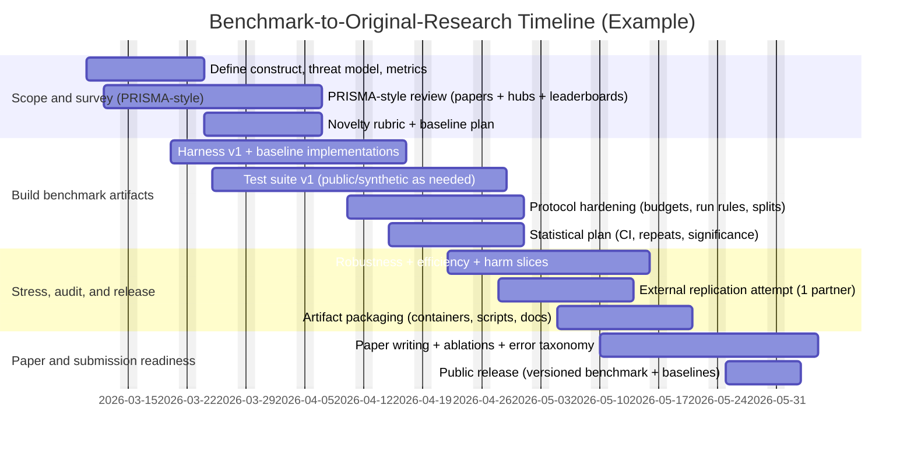

# From Benchmarking to Original Research in an Unspecified Domain

## Executive summary

An unspecified “idea” **can become original research** via “proper benchmarking” when the benchmark is treated as a **scientific instrument**—one that (a) measures a construct the community cares about, (b) controls degrees of freedom (protocols, baselines, budgets), (c) enables independent reproduction, and (d) yields **generalizable insights** beyond a single system’s internal QA. These expectations are now explicit in top venues: NeurIPS requires the paper checklist (with desk-reject risk if removed) and emphasizes rigor and transparency, and ICML’s reviewing criteria require claims supported by reproducible experiments (or sound theory) and grounded in prior work. citeturn1search0turn1search2

Benchmark-to-research transitions most often succeed under one (or more) of these contribution types:

- **Measurement contribution:** New metrics/protocols that *change conclusions* relative to existing evaluation practice (e.g., multi-metric tradeoffs, stress conditions, blind tests, anti-leakage rules). citeturn4search3turn6search0turn9search0  
- **Resource contribution:** A dataset/test-suite + baseline harness + artifact package that is usable, documented, and verifiable (aligned with artifact/badging programs common in systems/security). citeturn10search3turn1search3turn7search3  
- **Scientific contribution:** Analyses enabled by the benchmark (failure taxonomies, distribution-shift characterization, robustness/fairness slices, scaling/cost tradeoffs) that remain informative as models/systems evolve. citeturn5search0turn4search3turn9search0  

This report treats the domain as **unspecified** and provides generalizable criteria across AI/ML, systems, HCI, security, and applied sciences. It uses the uploaded **SVMP Systems v4.1** whitepaper (uploaded PDF) as the **primary case study**—extracting its benchmark-relevant claims and identifying what would be needed to convert those elements into publishable research.

## SVMP Systems v4.1 case study

### Benchmark-relevant claims and “tests” currently stated

The SVMP Systems v4.1 whitepaper frames its architecture around closing a “Reliability Gap” in LLM deployments and describes multiple **benchmark-like claims** and **test intentions** that can be converted into publishable evaluation—if formalized.

**Adversarial/security testing claims**
- “Aggressive Red Teaming” is described as the mechanism for closing the “Reliability Gap,” targeting **prompt injection** and **cross-tenant data leakage** (explicitly named). It reports “500+ specialized tests completed” and a plan to scale to “3,000+ tests by the end of 2026,” with an objective to validate the **0.75 similarity gate** against evolving jailbreak methods. (SVMP Systems v4.1, p. 15)

**Latency/throughput and performance claims**
- The document states the engine is optimized for **P90 internal latency < 1.5s** “post-debounce,” with a **2.5s ‘thought window’** for message aggregation before responding. (SVMP Systems v4.1, p. 15)  
- It claims “hundreds of stress tests” demonstrate the decoupled ingestor/processor design handles “hundreds of messages per second” without being slowed by LLM response times. (SVMP Systems v4.1, p. 6)

**Cost/efficiency claims**
- The executive summary claims the system can reduce LLM API overhead “by up to 60%” via message aggregation / state management ideas. (SVMP Systems v4.1, p. 3)  
- The debounce queue section states that introducing “2.5s ‘breathing room’” reduced overhead “by 40%.” (SVMP Systems v4.1, p. 11)

**Governance/auditability claims**
- The paper describes an append-only governance ledger (“Flight Data Recorder”) where “every decision, score, and API response” is logged for immutable record-keeping and per-tenant audit/debugging. (SVMP Systems v4.1, pp. 7, 13)

**Safety gate and human escalation**
- A core “Similarity Gate” is a threshold rule: reply only when similarity score **≥ 0.75**; otherwise “freeze” automation and “ping” a human (Slack/WhatsApp referenced in diagrams/text). (SVMP Systems v4.1, pp. 7, 12, 15)

### What makes these elements publishable—what’s missing today

SVMP already states **what** it wants to test (red teaming for injection/leakage; stress/latency; auditability) and gives **some target numbers** (P90 < 1.5s, similarity threshold 0.75, test counts, overhead reduction percentages). What is missing—relative to the standard expected in benchmark programs and dataset/benchmark tracks—is the conversion from narrative claims to a **reproducible measurement protocol**:

1. **Task/test-suite specification**  
   - SVMP mentions “specialized tests” but does not define a publicly reviewable test taxonomy, threat model, or scoring rules for jailbreak/leakage success. A publishable benchmark must specify the construct, adversary capabilities, allowed context, and what constitutes success/failure. This is analogous to how formal benchmark bodies encode run rules and disclosure expectations to control degrees of freedom (e.g., SPEC run & reporting rules; TPC full disclosure). citeturn6search0turn6search2  
   - For LLM security specifically, mapping tests to established risk categories improves construct clarity (e.g., prompt injection and data leakage appear as top risks in OWASP Top 10 for LLM Applications). citeturn10search4  

2. **Dataset/test-case release (or at least auditable test generation)**  
   - To be publishable and reusable, SVMP’s red-team suite would need (a) a shareable dataset of prompts/contexts or (b) a deterministic generator + seed set + rules that others can run. Modern benchmark ecosystems emphasize such accessibility: MLPerf provides implementation and submission rules; NIST programs release evaluation materials/software for reuse where possible. citeturn3search5turn6search7  

3. **Baselines and comparators**  
   - SVMP positions its architecture as closing a “Reliability Gap,” but publication requires showing how it compares to reasonable alternatives: other gating methods, other multi-tenant isolation strategies, other orchestration/queue strategies, and standard guardrail approaches. This is a frequent gap identified in benchmark-quality analyses. citeturn9search0  

4. **Statistical discipline and repeated trials**  
   - Claims like “40% overhead reduction” and “hundreds of messages per second” require variance reporting, workload definitions, and repeated runs. MLPerf explicitly notes training is stochastic and “time to solution exhibits high variance,” motivating careful benchmarking design. citeturn6search1  

5. **Reproducibility artifacts**  
   - Systems/security venues increasingly formalize artifact processes and badging (SIGCOMM artifact evaluation, USENIX artifact calls), and some venues require artifact availability declarations/availability at submission/acceptance. A publishable SVMP benchmark would benefit from containerized harnesses, scripts, and configuration disclosures. citeturn7search3turn1search3turn7search11turn10search6  

### Publishable research directions uniquely suggested by SVMP’s content

SVMP’s “multi-tenant governance + safety gate + red teaming” framing naturally maps to research contributions that are not “just another benchmark”:

- **A benchmark for cross-tenant leakage in RAG/agentic systems**: define test cases where an attacker tries to elicit Tenant B knowledge from Tenant A session contexts; measure leakage rate under different isolation strategies. The SVMP whitepaper already foregrounds “Data Cross-Talk” prevention as the primary multi-tenant challenge. (SVMP Systems v4.1, p. 9)  
- **Protocol paper on state-aware conversational debouncing**: characterize multi-burst behavior, define workloads, measure cost/quality tradeoffs; SVMP claims verified 2.5s debouncing affects overhead and similarity accuracy. (SVMP Systems v4.1, pp. 6, 11, 15)  
- **Auditability as an evaluation dimension**: formalize “forensic event” logging completeness/traceability metrics and show how they support debugging and compliance-oriented monitoring. (SVMP Systems v4.1, pp. 7, 13)  
- **Anti-Goodhart leaderboard design for red teaming**: if SVMP intends a living red-team suite, incorporate hidden tests, versioning, and policies to reduce “leaderboard illusion” distortions (e.g., best-of-N submissions). citeturn9search3turn9search0  

## Designing rigorous benchmarks

A rigorous benchmark is a **measurement system**. Across AI/ML, systems, HCI, security, and applied sciences, high-quality benchmarks converge on four principles: **construct validity**, **protocol control**, **statistical rigor**, and **reproducibility**. NeurIPS and ICML explicitly push authors toward these norms through their policies and review criteria. citeturn1search0turn1search2

image_group{"layout":"carousel","aspect_ratio":"16:9","query":["benchmark design template metrics datasets baselines reproducibility evaluation protocol diagram","MLPerf benchmark submission workflow rules diagram","PRISMA 2020 flow diagram systematic review"},"num_per_query":1}

### Domain-agnostic benchmark design template

The following template is designed to be “drop-in” across domains; you fill in domain-specific tasks, risks, and constraints.

| Component | Gold-standard definition | What to write down (minimum viable spec) | Primary sources that justify the standard |
|---|---|---|---|
| Construct & intended use | The benchmark measures a clearly defined concept tied to decisions | Task definition; intended users; in-scope/out-of-scope; stakeholder harm model | NeurIPS checklist & Datasets/Benchmarks emphasis on rigor and clarity citeturn1search0turn1search1 |
| Threat model / stress conditions | Evaluation includes the conditions that break systems in practice | Adversary capabilities; distribution shifts; workload bursts; failure modes | OWASP LLM Top 10 (for LLM security); WILDS (distribution shifts) citeturn10search4turn5search0 |
| Data / test suite | Representative, documented, auditable, and legally shareable | Data sources; sampling; annotation; splits; contamination controls; licenses | Datasheets for Datasets recommends standardized dataset documentation citeturn4search0 |
| Metrics | Multi-metric suite aligned to real outcomes, not only accuracy | Primary + diagnostic metrics; efficiency and harm metrics; confidence intervals | HELM uses multi-metric evaluation (accuracy, robustness, fairness, toxicity, efficiency, etc.) citeturn4search3 |
| Baselines | Strong, fair, and relevant comparisons | Simple baseline + best prior + competitive open baseline + ablations | Benchmark quality assessments find many benchmarks have weak comparators citeturn9search0 |
| Evaluation protocol | Degrees of freedom are controlled so comparisons mean something | Allowed training/tuning data; hyperparameter budgets; compute budgets; run rules | SPEC run rules demonstrate how protocols standardize comparability citeturn6search0 |
| Statistical analysis | Claims are supported under variance and uncertainty | Repeated runs; uncertainty; significance; robustness checks | BetterBench reports many benchmarks omit significance/replicability citeturn9search0 |
| Reproducibility & artifacts | Independent teams can rerun core results | Code + configs + environment + scripts; if not sharable, explain why | USENIX artifact guidance & ACM artifact badging principles citeturn1search3turn10search3 |
| Governance & versioning | The benchmark remains meaningful over time | Versioned test sets; changelog; deprecation plan; “hidden test” policy | MLPerf and NIST programs emphasize rules/policies and stable evaluation infrastructure citeturn3search13turn6search15 |

### Benchmark design checklist (minimum quality bar)

This checklist is intentionally compact; it is meant to be used as a go/no-go gate before publishing.

- **Construct validity**
  - [ ] The benchmark defines the construct and explicitly states intended use and limitations (scope, what it does not measure). citeturn1search1turn4search0  
- **Data integrity**
  - [ ] Data/test cases have documented provenance, licensing, sampling, and known risks (datasheet-style). citeturn4search0  
  - [ ] Splits and leakage controls are documented (especially critical if leaderboards exist). citeturn9search0  
- **Metrics**
  - [ ] A primary metric is paired with diagnostic metrics for robustness/fairness/efficiency where relevant. citeturn4search3turn4search1  
  - [ ] Uncertainty (CI/SE) and repeated trials are planned when stochasticity exists (common in ML and distributed systems). citeturn6search1  
- **Baselines**
  - [ ] At least one simple baseline, one “best prior,” and one strong open baseline are included, plus ablations. citeturn9search0  
- **Protocol control**
  - [ ] There is a written evaluation protocol controlling degrees of freedom (run rules, budgets, allowed tuning). citeturn6search0turn3search13  
- **Reproducibility**
  - [ ] A runnable harness + artifact package exists (scripts/configs/environment), aligned to artifact norms common in systems/security communities. citeturn7search3turn10search6turn10search3  
- **Benchmark governance**
  - [ ] Plans exist for versioning, updates, and anti-gaming measures (especially if a leaderboard is used). citeturn9search3turn3search13  

## Surveying benchmark literature and detecting novelty gaps

When the domain is **unspecified**, novelty detection must be systematic and cross-layer: **peer-reviewed literature** plus **benchmark ecosystems** (leaderboards, harness repositories, benchmark programs). A PRISMA-style workflow is useful for making the survey reproducible and auditable, even if the work is computer science rather than medicine. citeturn3search3turn3search15

### PRISMA-style workflow adapted to benchmark surveys

PRISMA 2020 provides checklists and flow diagrams for transparent reporting of systematic review steps (identification → screening → inclusion). Using this structure for benchmark surveys reduces the chance you miss de facto standards in practice. citeturn3search3turn3search15

A practical domain-agnostic workflow:

1. **Define the construct and evaluation space**  
   Specify the construct, threat model, and stakeholder outcomes. For AI systems with risk implications, anchor this to a risk framework so the evaluation dimensions map to real harms (e.g., NIST AI RMF and its Generative AI profile). citeturn4search2turn10search5  

2. **Build a query matrix**  
   Combine: domain task terms × benchmark/evaluation terms × failure mode terms. Example patterns:  
   - “benchmark OR evaluation OR test suite OR leaderboard”  
   - “robustness OR distribution shift OR adversarial OR red teaming”  
   - “latency OR throughput OR tail latency OR cost”  
   BetterBench shows quality varies widely; searching for “benchmark best practices” and “reproducibility” often surfaces meta-work that reveals common gaps. citeturn9search0  

3. **Search authoritative indices for papers, then expand by citation graph**  
   - DBLP (computer science bibliography, with API support) citeturn8search2turn8search6  
   - ACL venues and proceedings (ACL 2026 publication pipeline integrates ARR reviews) citeturn2search0turn2search4  
   - Citation expansion via Semantic Scholar API and/or OpenAlex (useful for “crowdedness” metrics). citeturn8search0turn8search5turn8search22  

4. **Search benchmark hubs and harness repositories (“practice layer”)**  
   - MLPerf policies and submission rules, plus official documentation (for benchmark governance and comparability practices). citeturn3search13turn3search1turn3search5  
   - Hugging Face Open LLM Leaderboard methodology references EleutherAI’s harness; these are real evaluation protocols used in practice. citeturn3search6turn3search10  
   - Papers With Code: if the site or UI state changes over time, the open data dumps (including evaluation tables) can still support systematic analysis. citeturn8search7  

5. **Screen and map benchmarks with a structured “benchmark card”**  
   For each benchmark, extract: construct, data, metrics, baselines, protocol restrictions, reproducibility artifacts, governance/versioning. This mirrors BetterBench’s approach of assessing benchmarks across lifecycle best practices and is specifically designed to detect where new benchmarks are needed vs where fields are saturated. citeturn9search0  

6. **Decide novelty using both scholarly and ecosystem signals**  
   Leaderboard distortions can create false perceptions of progress and maturity; thus novelty should consider anti-gaming design and statistical stability, not only number of papers. citeturn9search3turn9search0  

### Converting the workflow into SVMP-specific novelty questions

Because SVMP’s case falls at the intersection of **LLM deployment systems + security + governance**, the novelty lens should focus on “what is currently under-measured?” The SVMP whitepaper foregrounds:

- **Cross-tenant leakage and “data cross-talk” risks** (construct) (SVMP Systems v4.1, p. 9)  
- **Prompt injection / jailbreak attempts against gating and identity checks** (threat model) (SVMP Systems v4.1, p. 15)  
- **Tail latency and high-velocity multi-tenant workloads** (systems realism) (SVMP Systems v4.1, pp. 6, 15)  
- **Auditability (forensic event logs)** as a first-class requirement (SVMP Systems v4.1, p. 13)  

A novelty gap is plausible if the survey finds many LLM security benchmarks focus on jailbreak behaviors in single-tenant contexts, but few offer **cross-tenant isolation leakage evaluations** with explicit run rules, reproducible harnesses, and auditability metrics—particularly defined at the orchestration layer.

## Research themes that can arise from benchmark work

Benchmark work becomes original research when it yields **methodological innovation**, **new tasks**, or **new scientific conclusions**. Across the requested domains, the following themes are repeatedly publishable.

### Methodology and meta-benchmarking

Benchmark quality is uneven; meta-research shows many benchmarks do not report statistical significance and are not easily replicated. Designing and validating a benchmark-quality checklist, measurement taxonomy, or governance mechanism can itself be research when it changes how evaluation is done. citeturn9search0turn9search13  

SVMP alignment: the whitepaper already frames governance logging and red teaming as core; formalizing these as a benchmark methodology (not just internal practice) is a plausible research contribution (SVMP Systems v4.1, pp. 7, 13, 15).

### New tasks and new stress distributions

Many influential benchmarks are successful because they redefine what “hard” means by focusing on realistic distribution shifts or well-motivated stress conditions (rather than simply adding data). WILDS does this by curating datasets representing in-the-wild shifts underrepresented in standard datasets. citeturn5search0  

SVMP alignment: multi-tenant, bursty conversational workloads and cross-tenant leakage attempts are natural “stress distributions” that may be underrepresented in mainstream LLM evaluation.

### Robustness and adversarial evaluation

Adversarial robustness benchmarking becomes publishable when it standardizes threat models, budgets, and evaluation protocols so claims are comparable. RobustBench explicitly frames its goal as standardized adversarial robustness evaluation under computational budget constraints. citeturn5search1turn5search5  

SVMP alignment: SVMP’s “500+ red-team tests” claim can become publishable if those tests are organized into a standardized suite with clear scoring, budgets, and reproducible harnesses (SVMP Systems v4.1, p. 15). OWASP’s LLM risks taxonomy can provide a principled mapping from test cases to categories like prompt injection and data leakage. citeturn10search4  

### Fairness and subgroup harm analysis

In many applications, “average performance” hides systematic subgroup failures; model documentation frameworks explicitly recommend reporting performance across relevant groups and contexts. citeturn4search1  

SVMP alignment: if SVMP’s system serves multiple organizations and user personas, “tenant-level fairness” can be defined operationally (e.g., consistent false escalation rates, consistent leakage risk). This is domain-dependent and currently unspecified; it becomes tractable once the target tenant types and user populations are defined.

### Efficiency, cost, and system realism

Systems-oriented benchmarks become research when they define realistic workloads and rules that prevent misleading comparisons. SPEC is an archetype: it publishes run and reporting rules to standardize results and reduce degrees of freedom. citeturn6search0  
MLPerf frames performance benchmarking challenges in ML (variance, diversity, fairness) and encodes solutions into benchmark design. citeturn6search1turn3search13  

SVMP alignment: SVMP already provides latency targets (P90 < 1.5s post-debounce), throughput claims (“hundreds of messages per second”), and design plans (batching, Redis event-driven triggers). Turning these into a reproducible benchmark means defining workloads, measuring tail distributions, and releasing harnesses (SVMP Systems v4.1, pp. 6, 15).

### Interpretability, auditability, and deployment governance

Treating “every AI decision as a forensic event” is aligned with a governance-first view of evaluation, and risk frameworks emphasize ongoing measurement and monitoring across lifecycle. citeturn4search2turn10search5  

SVMP alignment: SVMP’s “append-only governance ledger” and “source attribution” can be evaluated with measurable auditability metrics (coverage, completeness, determinism, replayability) (SVMP Systems v4.1, p. 13).

## Novelty versus crowdedness

Because benchmark spaces can be crowded, a benchmark-based project is sufficiently novel when it either (a) measures a **missing construct**, (b) enforces protocol control that changes conclusions, or (c) creates a reusable resource that shifts community practice. BetterBench’s quality framework and “minimum quality assurance” framing is useful as a novelty lens because it highlights common gaps. citeturn9search0turn9search8

### A practical novelty rubric

Score each dimension 0–2; “likely publishable as benchmark research” tends to require **≥10/14**.

| Dimension | 0 (weak) | 1 (moderate) | 2 (strong) |
|---|---|---|---|
| Construct gap | Already measured well | Partially measured | Newly measured or fixes known failure mode |
| Protocol control | Loose, many degrees of freedom | Some controls | Run rules/budgets make comparisons meaningful |
| Baselines | Strawman or missing | Adequate | Strong baselines + ablations + competitive references |
| Statistical rigor | Single run, no uncertainty | Some repeats | Confidence intervals, significance, robustness checks |
| Anti-gaming design | Easy leaderboard overfitting | Partial mitigations | Hidden tests / dynamic splits / submission policies |
| Reproducibility | Hard to rerun | Some artifacts | Artifact-ready harness, scripts, environments |
| Generalizable insight | Mostly “our system wins” | Some analysis | Clear findings about failure modes/tradeoffs |

This rubric is consistent with (i) benchmark best-practice assessment framing (BetterBench), (ii) incentive/overfitting concerns in fast-moving ML (“Winner’s Curse?”), and (iii) evidence that leaderboards can create distorted playing fields (“Leaderboard Illusion”). citeturn9search0turn9search1turn9search3

### Citation and competition analysis methods

Because the domain is unspecified, use APIs that support objective field-maturity signals:

- **Semantic Scholar API**: identify top-cited benchmarks, growth rates, and co-citation communities. citeturn8search0turn8search8  
- **OpenAlex**: compute counts of works per concept/venue over time; use cited_by_count and works_count fields for maturity and competition intensity. citeturn8search5turn8search13turn8search22  
- **DBLP**: enumerate benchmark-relevant papers in core CS venues and quickly detect “crowding.” citeturn8search2turn8search6  
- **Papers With Code data dumps**: analyze how many tasks/datasets already have evaluation tables (a “practice-layer” saturation signal). citeturn8search7  

A key analytic point: field maturity is not only number of papers; it includes susceptibility to distortion. “Leaderboard Illusion” argues that leaderboard dynamics can violate assumptions and inflate performance signals, implying novelty can come from **better evaluation governance** even in crowded areas. citeturn9search3  

### Applying the novelty rubric to SVMP

If SVMP were submitted as-is, its novelty would be limited by missing reproducible benchmark artifacts. But SVMP’s stated goals suggest high novelty potential if formalized:

- **Strong potential (2/2)** on construct gap *if* cross-tenant leakage in multi-tenant LLM orchestration is systematically under-measured in existing benchmarks (requires survey). (SVMP Systems v4.1, p. 9)  
- **Strong potential** on anti-gaming and protocol control *if* the red-team suite includes hidden tests and explicit policies preventing iterative overfitting (a gap many benchmarks suffer). citeturn9search0turn9search3  
- **Currently weak** on reproducibility (0–1/2) until a public harness/test-suite/baseline package exists; systems/security venues increasingly reward or require artifact availability and reproducibility pathways. citeturn1search3turn10search6  

## Feasibility, deliverables, venues, and next steps

### Practical feasibility considerations

Because the “user idea” is **unspecified**, feasibility depends on the chosen evaluation scope. The following constraints apply broadly:

**Data sensitivity and legal constraints (unspecified)**  
If evaluation uses real user conversations, tenant knowledge bases, or production logs, public release may be infeasible. In that case, publishable alternatives include synthetic-but-realistic test generation, controlled public corpora, and “evaluation-as-a-service” with verifiable protocols. Risk frameworks emphasize lifecycle monitoring and transparency of evaluation; their guidance can justify careful handling of sensitive artifacts. citeturn4search2turn10search5  

**Compute and cost**  
Benchmarks fail reproducibility when they require large proprietary compute. MLPerf explicitly highlights affordability and fair comparison as benchmark goals, and artifact policies in systems emphasize enabling validation by others. citeturn6search1turn1search3turn10search3  

**Team size (rule-of-thumb)**  
- 1–2 people: feasible for a tight benchmark + harness + baseline suite (small-to-medium test suite).  
- 3–6 people: feasible for larger red-team suites, multi-metric evaluation, external replication, and strong artifact packaging.  
- 6+ / consortium: common for long-lived benchmark governance (leaderboards, frequent revisions), as in MLPerf-like ecosystems. citeturn3search13turn6search1  

### Suggested deliverables (benchmark-to-paper package)

A benchmark-based project is most publishable when the deliverables map directly to top-venue expectations:

1. **Benchmark specification** (task, threat model, protocols, reporting rules)  
   - Systems analog: SPEC-style run and reporting rules; database analog: TPC full disclosure specification. citeturn6search0turn6search2  

2. **Test suite or dataset + documentation**  
   - Datasheet-style dataset documentation; model-reporting documentation when applicable (model cards). citeturn4search0turn4search1  

3. **Evaluation harness + baselines**  
   - In LLM evaluation, harnesses like EleutherAI’s evaluation harness are used in real leaderboards; documenting harness choices is part of rigor. citeturn3search10turn3search6  

4. **Artifact package**  
   - Scripts, configs, environment (containers), and instructions; aligns with USENIX artifact evaluation and ACM artifact badging norms. citeturn1search3turn10search3turn7search3  

5. **Analytical report**  
   - Failure taxonomy, robustness slices, fairness/harms analysis (if relevant), efficiency/cost curves, and uncertainty reporting. BetterBench explicitly identifies that missing significance/replicability is common and is itself a gap you can address. citeturn9search0turn4search3  

### Likely publication venues (prioritized) and fit signals

The project domain is **unspecified**, so venue choice depends on what you claim. The following are high-probability fits if the contribution matches:

- NeurIPS (Datasets & Benchmarks track) for benchmark/dataset contributions with strong documentation and evaluation setup; the track exists precisely to reward benchmark-quality work. citeturn1search1  
- ICML for evaluation methodology or benchmark-enabled insights where claims are supported and well-positioned against prior work. citeturn1search2turn1search6  
- ACL ecosystem for evaluation methodology and datasets in NLP (submission pipeline details via ACL 2026 / ARR). citeturn2search0turn2search4  
- SIGCOMM for systems/networking work with artifacts; SIGCOMM runs artifact evaluation and awards badges. citeturn2search6turn7search3  
- CHI for human-centered evaluation instruments and transparent study protocols; CHI explicitly emphasizes transparency in review. citeturn2search1turn2search5  
- USENIX venues (NSDI/FAST/Security) for systems/security benchmarks and open-science artifacts; USENIX Security has open-science policy and artifact evaluation process details. citeturn1search3turn10search6turn10search14  

### Comparative examples of benchmark projects

The projects below illustrate how benchmarks become “research” by changing measurement practice, not merely producing scores.

| Example benchmark/program | Domain | Novelty angle | Outcome type | Venues / official anchors |
|---|---|---|---|---|
| MLPerf Training | AI systems | Handles ML-specific benchmarking challenges (variance, time-to-quality, diversity); encodes governance and comparability | Industry-standard performance benchmark suite | MLPerf training paper; MLCommons policies citeturn6search1turn3search13 |
| SPEC CPU2017 | Systems | Explicit run & reporting rules to control comparability and disclosure | Widely used standard benchmark | SPEC run rules citeturn6search0 |
| TPC-E | Databases | Full disclosure requirements (auditable reporting artifacts) | Comparable vendor benchmarking with disclosures | TPC-E spec (FDR clause) citeturn6search2 |
| TREC | Information retrieval | Evaluation infrastructure for shared tasks; releases test collections and evaluation processes | Long-running research evaluation ecosystem | NIST TREC overview and publications citeturn6search3turn6search15 |
| CASP | Applied science | Blind prediction + independent assessment as objective testing | Community-wide state-of-the-art tracking | PredictionCenter CASP description (blind prediction) citeturn7search0 |
| NIST FRVT | Applied security/biometrics | Large-scale independent evaluation measuring accuracy and computational efficiency | Vendor test program influencing practice | NIST FRVT program page citeturn7search1 |
| HELM | AI/ML eval | Multi-metric, scenario-based holistic evaluation; transparency as core goal | Reproducible evaluation framework and findings | HELM paper + official repo citeturn4search3turn4search15 |
| WILDS | AI robustness | Focus on in-the-wild distribution shifts underrepresented in common datasets | Standardized OOD benchmark suite | PMLR WILDS paper citeturn5search0 |
| RobustBench | Security/robust ML | Standardized adversarial robustness evaluation with restrictions and budgets | Leaderboard + standardized evaluation | NeurIPS Datasets & Benchmarks paper citeturn5search1turn5search5 |
| CheckList | Evaluation methodology | Behavioral testing approach for NLP beyond held-out accuracy; systematic test generation | Methodology + tooling adopted broadly | ACL Anthology paper citeturn5search2 |
| OWASP Benchmark Project | Security tooling | Labeled vulnerability test suites + scoring for accuracy/coverage/speed | Tool evaluation comparability | OWASP project page citeturn7search2 |

### Domain-selection options and tailored next steps (because domain is unspecified)

Since the user idea and constraints are **unspecified**, here are domain choices that preserve generality but enable concrete project planning:

1. **AI/ML evaluation benchmark**: dataset/test suite + multi-metric evaluation + baselines (NeurIPS D&B / ICML). citeturn1search1turn1search2  
2. **Systems benchmark**: workload + run rules + latency/throughput/cost instrumentation + artifact package (SIGCOMM/USENIX). citeturn6search0turn7search3turn1search3  
3. **Security red-team benchmark**: adversarial test suite with explicit threat model and scoring (USENIX Security / CCS-style, plus OWASP taxonomy). citeturn10search4turn10search6  
4. **HCI measurement instrument**: protocol + validated measures + reproducible study transparency (CHI). citeturn2search1turn2search5  
5. **Applied-science challenge**: blind evaluation + independent assessment structure (CASP/TREC-style). citeturn7search0turn6search3  

SVMP naturally fits options 2–3 (systems + security), but could also support option 1 if framed as evaluation of LLM governance strategies.

### A concrete decision checklist

Use this checklist to decide if the benchmark effort is likely to become publishable original research.

- [ ] **Unspecified → specified construct:** Can you state the construct (e.g., “cross-tenant leakage resistance under multi-burst sessions”) in one sentence, plus what decisions it supports?  
- [ ] **Benchmark gap:** Does a PRISMA-style survey show that existing benchmarks do not measure this construct well (or at all)? citeturn3search3turn9search0  
- [ ] **Protocol control:** Do you have rules/budgets/run conditions that prevent gaming and reduce degrees of freedom (like SPEC/MLPerf)? citeturn6search0turn3search13  
- [ ] **Multi-metric realism:** Are you reporting tradeoffs (robustness + efficiency + harms) rather than a single score? citeturn4search3  
- [ ] **Baselines:** Do you have strong baselines and ablations? citeturn9search0  
- [ ] **Reproducibility:** Can an independent team rerun core results with your artifacts? (USENIX/ACM norms) citeturn1search3turn10search3turn10search6  
- [ ] **Ethics/legal feasibility (unspecified):** Are data rights and privacy constraints compatible with publication, or do you have a publishable synthetic/public proxy? citeturn4search2turn10search5  

### SVMP-tailored recommended next steps

These steps convert SVMP’s stated claims into a publishable benchmark research program:

1. **Formalize SVMP’s threat model and test taxonomy**  
   Map “prompt injection,” “cross-tenant data leakage,” and “bypass similarity gate” tests into categories (OWASP LLM Top 10 is a strong anchor taxonomy). (SVMP Systems v4.1, p. 15) citeturn10search4  

2. **Define measurable outcomes for each SVMP claim**  
   Examples: leakage-attempt success rate, jailbreak success rate, false escalation rate, tail latency (P90/P99), throughput under burst workloads, cost per resolved query, audit log completeness. (SVMP Systems v4.1, pp. 6, 7, 13, 15)

3. **Build a reproducible harness and baseline suite**  
   Create a runner that accepts a system under test and executes standardized scenarios; publish baseline approaches (e.g., similarity gating alone vs gating + isolation enforcement; different debounce windows). Artifact expectations in systems/security strongly reward this. citeturn7search3turn10search6turn10search3  

4. **Add anti-gaming measures if a leaderboard is planned**  
   Use hidden tests, versioning, and submission rules to avoid distorted playing fields (leaderboard illusion dynamics). citeturn9search3turn3search13  

5. **Document datasets and outputs using standardized templates**  
   Datasheets for test suites; model cards if any models are released; benchmark “cards” describing the full protocol. citeturn4search0turn4search1  

### Example Gantt timeline (mermaid)



### Key official sources (copy/paste)

```text
NeurIPS Paper Checklist: https://neurips.cc/public/guides/PaperChecklist
NeurIPS Datasets & Benchmarks track: https://neurips.cc/Conferences/2025/CallForDatasetsBenchmarks
ICML 2026 Call for Papers: https://icml.cc/Conferences/2026/CallForPapers
CHI 2026 transparency guidance: https://chi2026.acm.org/guide-to-a-successful-submission/
SIGCOMM 2026 CfP (artifact evaluation): https://conferences.sigcomm.org/sigcomm/2026/cfp/
USENIX NSDI artifacts: https://www.usenix.org/conference/nsdi26/call-for-artifacts
USENIX Security open-science policy: https://www.usenix.org/conference/usenixsecurity26/call-for-papers
MLPerf inference rules: https://github.com/mlcommons/inference_policies/blob/master/inference_rules.adoc
MLPerf submission rules: https://github.com/mlcommons/policies/blob/master/submission_rules.adoc
Hugging Face Open LLM Leaderboard methodology: https://huggingface.co/blog/open-llm-leaderboard-mmlu
EleutherAI LM eval harness leaderboard tasks: https://github.com/EleutherAI/lm-evaluation-harness/blob/main/lm_eval/tasks/leaderboard/README.md
PRISMA 2020 checklist: https://www.prisma-statement.org/prisma-2020-checklist
Datasheets for Datasets (arXiv): https://arxiv.org/abs/1803.09010
Model Cards (arXiv): https://arxiv.org/abs/1810.03993
BetterBench (arXiv): https://arxiv.org/abs/2411.12990
```

