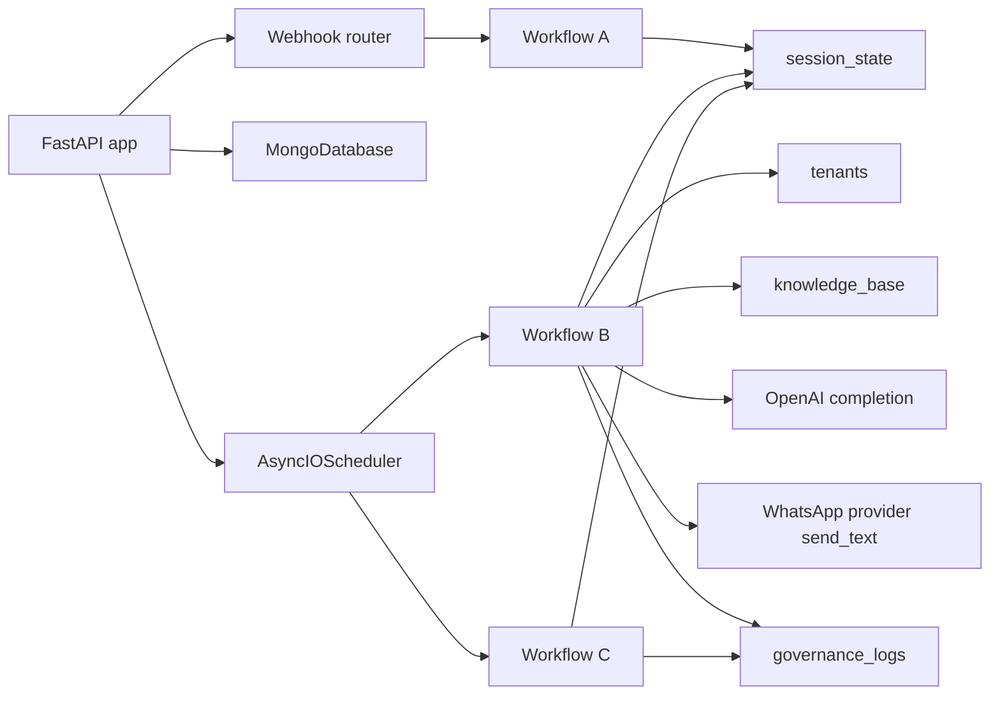
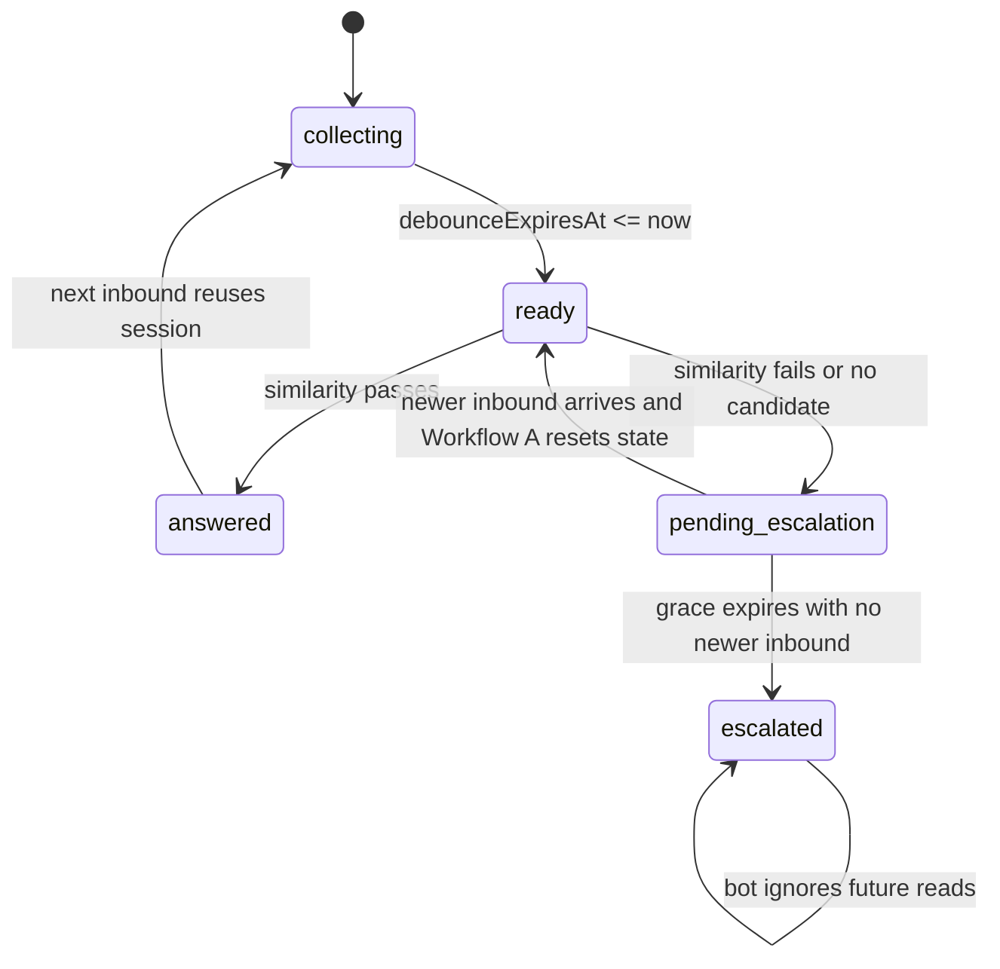

# SVMP Runtime Wiring And Deep Architecture

## Purpose

This document is the deeper runtime companion to `system_architecture.md`.

It focuses on:

- how the live process is wired together
- how session state actually moves through the system
- where timing and latency are recorded
- how delayed escalation is implemented
- where race conditions can happen and how the current code handles them
- what the main next-step architecture options are

## Runtime Component Graph

## Process Wiring

### `create_app()`

`svmp_core/main.py` wires three long-lived runtime objects:

- `Settings`
- `MongoDatabase`
- `AsyncIOScheduler`

Startup sequence:

1. validate runtime config
2. configure logging
3. connect Mongo
4. register `workflow_b`
5. register `workflow_c`
6. start scheduler
7. store dependencies on `app.state`

Shutdown sequence:

1. stop scheduler without waiting for a clean drain
2. disconnect Mongo

### Scheduler job shape

Workflow B is registered as:

- interval trigger
- every `WORKFLOW_B_INTERVAL_SECONDS`
- one job id: `workflow_b`

Workflow C is registered as:

- interval trigger
- every `WORKFLOW_C_INTERVAL_HOURS`
- one job id: `workflow_c`

Operational consequence:

- there is one shared Workflow B worker loop for the whole app
- sessions are not individually scheduled
- long OpenAI or provider calls can make later interval ticks skip

## Webhook Wiring

### Intake layers

The live intake path inside `svmp_core/routes/webhook.py` is:

1. parse request body
2. resolve provider
3. resolve tenant when needed
4. normalize provider payload into one or more `WebhookPayload`s
5. run Workflow A once per normalized payload
6. return `status=accepted`

### Why Twilio and Meta can share the same downstream flow

All provider-native payloads collapse into the same normalized shape:

- `tenantId`
- `clientId`
- `userId`
- `text`
- `provider`
- `externalMessageId`

That means Workflow A and Workflow B do not need provider-specific branching for session management.

## Session State Wiring

### Identity model

The stable session identity tuple is:

- `tenantId`
- `clientId`
- `userId`

Mongo enforces uniqueness on that tuple.

### Session-state fields that matter most at runtime

- `status`
  currently `open` or `closed`
- `processing`
  Workflow B acquisition latch
- `escalate`
  final “bot must no longer read this session” flag
- `pendingEscalation`
  grace-window marker before final escalation
- `pendingEscalationExpiresAt`
  finalization deadline for pending escalation
- `pendingEscalationMetadata`
  reason and context snapshot for a delayed escalation
- `messages`
  current unprocessed inbound window
- `context`
  previously processed windows, stored as strings
- `debounceExpiresAt`
  time after which the current window can be processed

### State machine

## Workflow A Wiring

Workflow A is intentionally simple and aggressive about letting newer inbound win.

### Create path

If no session exists:

- create new session
- set `processing = false`
- set `escalate = false`
- set `pendingEscalation = false`
- set `messages = [new message]`
- set `debounceExpiresAt = now + DEBOUNCE_MS`

### Update path

If a session exists:

- append new message
- update provider
- force `status = open`
- set `processing = false`
- clear pending escalation fields
- reset `debounceExpiresAt`

Important behavioral consequence:

- pending escalation is not sticky when the user keeps typing
- final escalation is sticky

## Workflow B Wiring

Workflow B does the heavy work and carries most of the latency budget.

### Acquisition phase

Mongo selection order is effectively:

1. due pending escalations
2. normal debounce-ready sessions

This lets final escalation complete when no newer inbound has interrupted it.

### Processing phases

For a normal ready session, Workflow B runs:

1. acquire session
2. build active question and archived context
3. load tenant config
4. resolve threshold
5. choose domain
6. load FAQ candidates
7. call OpenAI matcher
8. parse matcher result
9. run deterministic similarity gate
10. answer immediately or arm pending escalation

For a due pending escalation, Workflow B runs:

1. acquire session
2. verify pending escalation is not stale
3. finalize escalation
4. write governance log
5. archive processed window

## Delayed Escalation Wiring

### Why it exists

Without a grace window, short incomplete fragments can escalate too early while the user is still typing.

### How it works now

When Workflow B decides it cannot safely answer:

- do not send a fallback message
- do not write the final escalation log yet
- set:
  - `pendingEscalation = true`
  - `pendingEscalationExpiresAt = now + ESCALATION_GRACE_SECONDS`
  - `pendingEscalationMetadata = { reason, target, activeQuestion, activeMessages, context, matcher metadata }`

If no new inbound arrives:

- Workflow B later acquires the same session as a due pending escalation
- finalizes escalation
- writes governance log
- marks `escalate = true`

If new inbound arrives:

- Workflow A clears pending escalation
- the old pending record is discarded
- a new debounce window starts

## Race Handling And Supersession

### The main production race

The main live race is:

1. Workflow B acquires a session
2. Workflow B spends 1-3 seconds in OpenAI
3. user sends another message during that OpenAI call
4. Workflow A updates the session
5. old Workflow B run returns and tries to act on stale context

### Current protection

Before Workflow B arms pending escalation, it reloads the latest session and checks whether:

- message count changed
- message content changed
- session timestamps moved forward

If yes:

- the old run releases `processing`
- logs `workflow_b_requeued_due_to_newer_messages`
- exits without arming pending escalation

There is a second guard for stale pending escalation:

- if `pendingEscalationStartedAt` is older than the newest inbound message time
- the pending escalation is canceled instead of finalized

## Timing And Observability Wiring

### Live logs

The most useful live events are:

- `webhook_intake_completed`
- `workflow_a_completed`
- `workflow_b_requeued_due_to_newer_messages`
- `workflow_b_pending_escalation_started`
- `workflow_b_pending_escalation_canceled`
- `workflow_b_completed`
- `workflow_b_failed`

Each trace contains:

- `startedAt`
- `finishedAt`
- `durationMs`
- `steps[]`

### Persisted timing

For answered or escalated outcomes, `governance_logs.metadata.timing` stores:

- `workflow`
  step-level Workflow B execution timing
- `messageWindow`
  queueing and debounce timing

`messageWindow` currently includes:

- `firstMessageAt`
- `lastMessageAt`
- `debounceExpiresAt`
- `workflowBStartedAt`
- `sessionAcquiredAt`
- `pendingEscalationStartedAt`
- `pendingEscalationExpiresAt`

It also includes derived durations such as:

- `lastMessageToDebounceExpiry`
- `debounceExpiryToWorkflowBStart`
- `lastMessageToWorkflowBStart`
- `pendingEscalationStartToExpiry`
- `pendingEscalationExpiryToWorkflowBStart`

## Runtime Behaviors Visible In The Terminal

### `maximum number of running instances reached (1)`

This means:

- the interval job fired again
- the previous Workflow B run was still executing
- APScheduler skipped the overlapping invocation

It is not a crash, but it does increase effective latency because the system cannot start another Workflow B run until the current one finishes.

### `workflow_b_requeued_due_to_newer_messages`

This means:

- the old run was superseded by newer inbound
- no answer or escalation was committed from that stale run
- the newer inbound window should be processed on the next eligible cycle

### `workflow_b_pending_escalation_started`

This means:

- the bot decided not to answer yet
- the session is waiting through the grace window

It is not final escalation by itself.

## Current Wiring Tradeoffs

### Good properties

- simple mental model
- all inbound providers share one normalized path
- clear session-state contract
- race handling is explicit instead of implicit
- rich timing data is available both live and persisted

### Costly properties

- poll-based Workflow B adds extra delay after debounce
- one long OpenAI call blocks overlapping Workflow B runs
- full FAQ list is still sent to OpenAI
- final escalated sessions stay bot-muted until manually reset

## Architecture Plans

### Plan A: Per-session scheduling instead of polling

Replace global Workflow B polling with:

- schedule one job per session at `debounceExpiresAt`
- cancel and reschedule on each new inbound
- schedule pending-escalation finalization at `pendingEscalationExpiresAt`

Expected win:

- remove most of the `debounceExpiryToWorkflowBStart` delay
- eliminate noisy skipped interval ticks

Expected cost:

- more scheduler complexity
- explicit cancel/reschedule logic per identity

### Plan B: Candidate pre-slicing before OpenAI

Before sending FAQ candidates to OpenAI:

- pre-rank or pre-filter them using deterministic heuristics
- optionally add embeddings later

Expected win:

- lower OpenAI latency
- lower token usage

Expected cost:

- more routing complexity

### Plan C: Separate outbound send from the critical answer path

Move provider send into its own async queue or worker.

Expected win:

- lower visible Workflow B critical-path time
- less scheduler blocking due to Twilio or Meta latency

Expected cost:

- answer acceptance and actual delivery become separate states
- more operational moving parts

### Plan D: Explicit escalated-session reset path

Add admin or operator tooling to clear:

- `escalate`
- `pendingEscalation`
- `processing`

Expected win:

- easier recovery when human handling is done

Expected cost:

- requires access control and operational discipline
