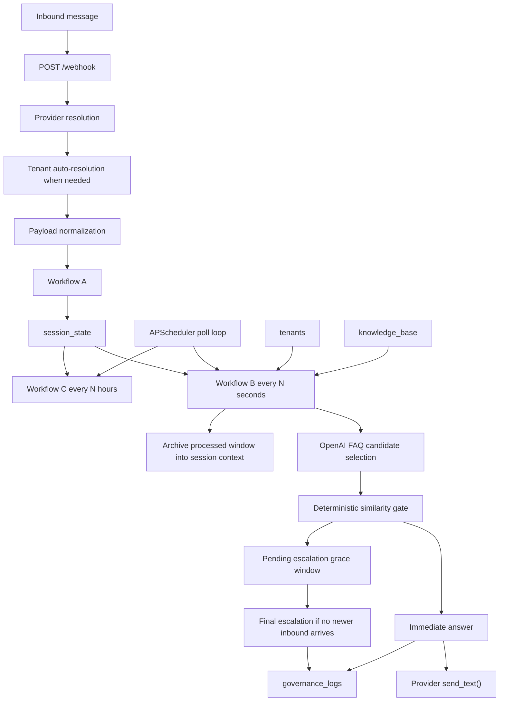

# SVMP System Architecture

## Purpose

SVMP is a Mongo-backed FastAPI service for tenant-scoped WhatsApp support automation.

In the current branch, the running system:

- accepts inbound WhatsApp messages through normalized, Meta, and Twilio-compatible webhook paths
- resolves `tenantId` from provider payloads when it is not supplied directly
- buffers inbound fragments into a mutable `session_state` document
- applies a short debounce window before automated processing
- processes ready sessions in Workflow B on a poll-based APScheduler interval
- routes each session into a tenant domain
- loads tenant/domain FAQ entries from MongoDB
- uses OpenAI to choose the best FAQ candidate
- applies a deterministic similarity gate
- answers immediately when confidence passes
- delays escalation behind a separate grace window when confidence fails
- suppresses bot processing after a session has been finally escalated
- writes immutable governance logs with step-level timing metadata
- deletes stale sessions in Workflow C

This document is a current-state snapshot of the active runtime.

## Repository Structure

### `svmp-core/`

Primary runtime code.

- `svmp_core/main.py`
  FastAPI app factory, runtime lifecycle, scheduler registration
- `svmp_core/routes/webhook.py`
  inbound webhook verification and intake
- `svmp_core/workflows/workflow_a.py`
  inbound buffering, debounce reset, pending-escalation reset
- `svmp_core/workflows/workflow_b.py`
  ready-session acquisition, FAQ matching, answer or delayed-escalation decisioning
- `svmp_core/workflows/workflow_c.py`
  stale-session cleanup
- `svmp_core/db/`
  repository contracts plus MongoDB implementation
- `svmp_core/models/`
  session, webhook, knowledge, and governance models
- `svmp_core/integrations/`
  OpenAI and WhatsApp provider adapters
- `svmp_core/core/`
  identity, routing, similarity, governance, timing, and escalation helpers

### `docs/`

Supporting notes and deeper architecture references.

### `scripts/`

Operational helpers for seeding and verification.

### `svmp-platform/`

Reserved for future platform work. It is not part of the active runtime.

## High-Level Runtime Flow



## FastAPI Application

`svmp_core/main.py` creates the app and wires runtime dependencies.

### Startup behavior

- loads settings from `.env`
- validates required runtime configuration
- configures logging
- connects MongoDB
- registers Workflow B and Workflow C on an `AsyncIOScheduler`
- starts the scheduler if it is not already running
- stores `settings`, `database`, and `scheduler` on `app.state`

### Shutdown behavior

- stops the scheduler
- disconnects MongoDB

### HTTP endpoints

- `GET /health`
- `GET /webhook`
- `POST /webhook`

## Scheduler

The current runtime uses `AsyncIOScheduler` with UTC timestamps.

Registered jobs:

- `workflow_b`
  interval job using `WORKFLOW_B_INTERVAL_SECONDS`
- `workflow_c`
  interval job using `WORKFLOW_C_INTERVAL_HOURS`

Important current-state notes:

- Workflow B is still poll-based, not per-session event scheduled
- APScheduler only allows one Workflow B instance at a time in the live runtime
- when one Workflow B run is still busy, overlapping poll ticks are skipped
- those skipped ticks show up in terminal output as `maximum number of running instances reached (1)`

## Webhook Route

`svmp_core/routes/webhook.py` is the ingress boundary.

### Provider resolution

Provider detection order:

1. `X-SVMP-Provider` header or `provider` query parameter
2. normalized JSON markers inside the payload
3. `application/x-www-form-urlencoded` content type, treated as Twilio
4. fallback to `WHATSAPP_PROVIDER`

Supported providers:

- `normalized`
- `meta`
- `twilio`

### Tenant resolution

If provider-native payloads omit `tenantId`, the route resolves it from MongoDB using provider identities.

Meta identities:

- `phone_number_id`
- `display_phone_number`

Twilio identities:

- `To`
- `AccountSid`

Mongo tenant-channel mappings:

- `channels.meta.phoneNumberIds`
- `channels.meta.displayNumbers`
- `channels.twilio.whatsappNumbers`
- `channels.twilio.accountSids`

If no unique tenant can be resolved, intake fails with `400`.

### Intake result

For each normalized inbound payload:

- Workflow A is invoked immediately
- the returned `sessionId` is surfaced in the HTTP response

Successful intake response:

```json
{
  "status": "accepted",
  "sessionId": "..."
}
```

## Workflow A: Ingest and Debounce

Implemented in `svmp_core/workflows/workflow_a.py`.

Purpose:

- normalize the inbound fragment into the active identity tuple
- create or update the session document
- append the new message to the current window
- reset debounce timing
- clear processing and pending escalation so newer user context wins

Behavior:

- trims inbound text and rejects blank messages
- builds `IdentityFrame` from `tenantId + clientId + userId`
- looks up the session by that tuple
- if missing:
  - creates a new `SessionState`
  - sets `processing = false`
  - sets `escalate = false`
  - sets `pendingEscalation = false`
  - writes one `MessageItem`
- if present:
  - appends a new `MessageItem`
  - refreshes `provider`
  - forces `status = "open"`
  - sets `processing = false`
  - clears `pendingEscalation`
  - clears `pendingEscalationExpiresAt`
  - clears `pendingEscalationMetadata`
- always resets `debounceExpiresAt = now + DEBOUNCE_MS`

Important current-state note:

- Workflow A preserves final `escalate = true` if a session has already been escalated
- but it still records later inbound messages on that same session identity

## Workflow B: Process, Decide, and Send

Implemented in `svmp_core/workflows/workflow_b.py`.

Purpose:

- acquire one ready session atomically
- build the active message window
- resolve tenant and domain
- evaluate FAQ candidates
- answer immediately when confidence passes
- otherwise start or finalize delayed escalation
- write governance logs with detailed timing
- archive the processed window into session context

### Ready-session acquisition

Workflow B acquires exactly one session in one of two states:

- normal ready session
  - `status = "open"`
  - `processing = false`
  - `escalate != true`
  - `pendingEscalation != true`
  - `debounceExpiresAt <= now`
- pending escalation ready to finalize
  - `status = "open"`
  - `processing = false`
  - `escalate != true`
  - `pendingEscalation = true`
  - `pendingEscalationExpiresAt <= now`

Mongo flips `processing = true` during acquisition.

### Active window vs archived context

Workflow B derives:

- `activeMessages`
  raw messages in the current unprocessed window
- `activeQuestion`
  concatenation of `activeMessages`
- `context`
  concatenation of archived processed windows from `session.context`

Matching contract:

- `activeQuestion` is the primary decision input
- `context` is secondary and only helps with clear references back to earlier turns

### Domain resolution

Workflow B loads the tenant document and selects a domain using deterministic keyword overlap from domain:

- `domainId`
- `name`
- `description`
- `keywords`

Threshold resolution:

- prefer `tenants.settings.confidenceThreshold`
- fall back to global `SIMILARITY_THRESHOLD` when tenant config is missing or malformed

### OpenAI matcher

Workflow B currently uses the direct OpenAI matcher path.

The matcher returns:

- `bestIndex`
- `similarityScore`
- `reason`

Important current-state notes:

- scores in `0-1` and `0-100` format are normalized to `0-1`
- `bestIndex = null` is treated as no safe candidate
- `USE_OPENAI_MATCHER`, `OPENAI_SHADOW_MODE`, and `OPENAI_MATCHER_CANDIDATE_LIMIT` still exist in config, but they do not currently change the main Workflow B path

### Similarity gate

The final answer/escalate decision is deterministic.

- no candidate or no score means no safe FAQ answer
- score `>= threshold` means answer
- score `< threshold` means do not answer automatically

### Answer path

If the gate passes:

- send the matched FAQ answer immediately through the session provider
- write an answered governance log
- archive the processed active window into `session.context`
- clear `messages`
- leave the session reusable for future inbound turns

### Delayed escalation path

If the gate fails, no candidate exists, or the domain cannot be resolved:

- Workflow B does not escalate immediately
- instead, it starts a pending escalation grace window using `ESCALATION_GRACE_SECONDS`
- it writes:
  - `pendingEscalation = true`
  - `pendingEscalationExpiresAt = now + grace`
  - `pendingEscalationMetadata = {...}`
- no outbound message is sent at that moment
- no governance escalation log is written at that moment

If no newer inbound arrives before `pendingEscalationExpiresAt`:

- Workflow B acquires the same session again
- finalizes escalation
- writes the escalated governance log
- archives the processed window
- sets `escalate = true`
- clears pending escalation fields

If a newer inbound arrives before the grace expires:

- Workflow A clears the pending escalation state
- a new debounce window starts
- Workflow B evaluates the newer window instead

### Race protection for newer inbound

The current branch explicitly handles the case where:

- Workflow B is still inside OpenAI
- a newer message arrives
- the old Workflow B run finishes late

Current protection:

- Workflow B re-checks the latest session before arming pending escalation
- if newer messages arrived mid-run, the old run exits as `workflow_b_requeued_due_to_newer_messages`
- stale pending escalation is canceled instead of being finalized against older message state

### Session archiving behavior

After answer or final escalation:

- processed messages are moved into `context`
- only newer unprocessed suffix messages remain in `messages`
- `pendingEscalation` fields are cleared
- `processing` is reset when newer messages remain, otherwise the archived session stays latched until the next inbound reset

### Failure behavior

If Workflow B fails after acquisition:

- it logs `workflow_b_failed`
- it attempts to release the `processing` latch by setting `processing = false`
- it raises `DatabaseError("workflow b processing failed")`

This is a change from the older behavior where failures could leave the session latched indefinitely.

## Workflow C: Cleanup

Implemented in `svmp_core/workflows/workflow_c.py`.

Purpose:

- delete stale sessions beyond the retention window

Current behavior:

- computes `cutoff_time = now - WORKFLOW_C_INTERVAL_HOURS`
- deletes stale sessions through the session repository
- governance `closed` logs are only written when the repository can enumerate stale sessions first

Important Mongo note:

- the default Mongo repository deletes stale sessions
- it does not currently enumerate them for per-session closure audit logging first

## Data Model

### `session_state`

Mutable active conversation state.

```json
{
  "_id": "ObjectId",
  "tenantId": "Stay",
  "clientId": "whatsapp",
  "userId": "9845891194",
  "provider": "twilio",
  "status": "open",
  "processing": false,
  "escalate": false,
  "pendingEscalation": false,
  "pendingEscalationExpiresAt": null,
  "pendingEscalationMetadata": {},
  "context": [
    "What size are STAY perfume bottles?"
  ],
  "messages": [
    {
      "text": "Do you offer discounts?",
      "at": "2026-04-01T10:00:00Z"
    }
  ],
  "createdAt": "ISODate",
  "updatedAt": "ISODate",
  "debounceExpiresAt": "ISODate"
}
```

Meaning of escalation fields:

- `escalate = false`
  session is still bot-readable
- `pendingEscalation = true`
  session is waiting through the grace window before final escalation
- `escalate = true`
  session has been finally escalated and Workflow B will not read it anymore

### `knowledge_base`

Tenant/domain FAQ corpus.

```json
{
  "_id": "faq-pricing",
  "tenantId": "Stay",
  "domainId": "general",
  "question": "How much do STAY Parfums fragrances cost?",
  "answer": "Most fragrances currently show a regular price of Rs. 1,999 and a sale price of Rs. 1,499 on the site.",
  "tags": ["pricing", "offer", "sale"],
  "active": true,
  "createdAt": "ISODate",
  "updatedAt": "ISODate"
}
```

### `tenants`

Tenant metadata, routing, thresholds, and provider channel mappings.

```json
{
  "tenantId": "Stay",
  "domains": [
    {
      "domainId": "general",
      "name": "General",
      "description": "Questions about STAY Parfums products, pricing, shipping, availability, brand details, and support.",
      "keywords": ["perfume", "fragrance", "price", "shipping", "stock", "contact", "offer"]
    }
  ],
  "settings": {
    "confidenceThreshold": 0.75
  },
  "channels": {
    "meta": {
      "phoneNumberIds": ["1234567890"],
      "displayNumbers": ["+15551234567"]
    },
    "twilio": {
      "whatsappNumbers": ["whatsapp:+14155238886"],
      "accountSids": ["AC123"]
    }
  }
}
```

### `governance_logs`

Immutable audit trail for answered, escalated, and cleanup outcomes.

```json
{
  "_id": "ObjectId",
  "tenantId": "Stay",
  "clientId": "whatsapp",
  "userId": "9845891194",
  "decision": "answered",
  "similarityScore": 0.92,
  "combinedText": "How much do STAY Parfums fragrances cost?",
  "answerSupplied": "Most fragrances currently show a regular price of Rs. 1,999 and a sale price of Rs. 1,499 on the site.",
  "timestamp": "ISODate",
  "metadata": {
    "workflow": "workflow_b",
    "decision": "answered",
    "decisionReason": "score meets or exceeds threshold",
    "latencyMs": 742,
    "sessionId": "session-1",
    "provider": "twilio",
    "identity": {
      "tenantId": "Stay",
      "clientId": "whatsapp",
      "userId": "9845891194"
    },
    "similarity": {
      "score": 0.92,
      "threshold": 0.75,
      "outcome": "pass",
      "candidateFound": true
    },
    "domainId": "general",
    "matcherUsed": "openai",
    "matcherReason": "selected by OpenAI matcher",
    "candidatesConsidered": 10,
    "activeQuestion": "How much do STAY Parfums fragrances cost?",
    "activeMessages": [
      "How much do STAY Parfums fragrances cost?"
    ],
    "context": "What size are STAY perfume bottles?",
    "matchedQuestion": "How much do STAY Parfums fragrances cost?",
    "timing": {
      "workflow": {},
      "messageWindow": {}
    },
    "delivery": {
      "provider": "twilio",
      "status": "accepted",
      "externalMessageId": "SM..."
    }
  }
}
```

Timing notes:

- `metadata.timing.workflow` stores Workflow B step timings
- `metadata.timing.messageWindow` stores queueing, debounce, and pending-escalation timings

## MongoDB Persistence

Mongo persistence lives in `svmp_core/db/mongo.py`.

Repositories:

- `MongoSessionStateRepository`
- `MongoKnowledgeBaseRepository`
- `MongoGovernanceLogRepository`
- `MongoTenantRepository`

### Current indexes

`session_state`

- unique identity index on `tenantId + clientId + userId`
- readiness index on:
  - `processing`
  - `escalate`
  - `pendingEscalation`
  - `pendingEscalationExpiresAt`
  - `debounceExpiresAt`

`knowledge_base`

- lookup index on `tenantId + domainId + active`

`governance_logs`

- lookup index on `tenantId + timestamp`

`tenants`

- unique partial index on `tenantId`

## Environment and Runtime Contract

Settings live in `svmp_core/config.py`.

### Core settings

- `APP_NAME`
- `APP_ENV`
- `LOG_LEVEL`
- `PORT`

### Mongo settings

- `MONGODB_URI`
- `MONGODB_DB_NAME`
- `MONGODB_SESSION_COLLECTION`
- `MONGODB_KB_COLLECTION`
- `MONGODB_GOVERNANCE_COLLECTION`
- `MONGODB_TENANTS_COLLECTION`

### OpenAI settings

- `OPENAI_API_KEY`
- `EMBEDDING_MODEL`
- `LLM_MODEL`
- `USE_OPENAI_MATCHER`
- `OPENAI_SHADOW_MODE`
- `OPENAI_MATCHER_CANDIDATE_LIMIT`

### WhatsApp settings

- `WHATSAPP_PROVIDER`
- `WHATSAPP_TOKEN`
- `WHATSAPP_PHONE_NUMBER_ID`
- `WHATSAPP_VERIFY_TOKEN`
- `TWILIO_ACCOUNT_SID`
- `TWILIO_AUTH_TOKEN`
- `TWILIO_WHATSAPP_NUMBER`

### Workflow settings

- `DEBOUNCE_MS`
- `ESCALATION_GRACE_SECONDS`
- `SIMILARITY_THRESHOLD`
- `WORKFLOW_B_INTERVAL_SECONDS`
- `WORKFLOW_C_INTERVAL_HOURS`

## Current Constraints and Tradeoffs

### Poll-based Workflow B

User-visible latency still includes:

- debounce delay
- up to one poll interval before acquisition
- OpenAI latency
- outbound provider latency

### Single running Workflow B instance

Long OpenAI or outbound calls can cause skipped poll ticks and extra wait.

### Full tenant/domain FAQ list sent to OpenAI

Current matcher simplicity keeps behavior understandable, but increases token usage and latency.

### Final escalated sessions are sticky

Once `escalate = true`, Workflow B will no longer process that session until it is manually reset.

## Recommended Verification Flow

1. Seed tenant data and FAQ data.
2. Start the app with `uvicorn`.
3. Verify `GET /health`.
4. Send a webhook request.
5. Watch terminal events:
   - `webhook_intake_completed`
   - `workflow_a_completed`
   - `workflow_b_requeued_due_to_newer_messages`
   - `workflow_b_pending_escalation_started`
   - `workflow_b_completed`
6. Inspect `session_state` and `governance_logs`.
7. Use `governance_logs.metadata.timing` to break down debounce, poll delay, OpenAI, and outbound latency.

## Summary

SVMP is currently a working FastAPI + Mongo + OpenAI orchestration service for tenant-scoped WhatsApp support automation.

The current runtime is best described as:

- provider-aware at ingress
- tenant-aware during intake and decisioning
- session-buffered with archived context
- poll-based in Workflow B
- OpenAI-assisted for FAQ candidate selection
- deterministic at the final answer gate
- delayed, stateful, and race-aware in escalation handling
- governed through immutable audit logs with step-level timing
