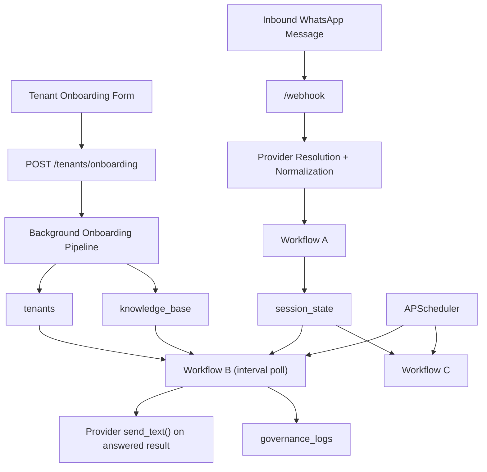

# SVMP System Architecture

## Purpose

SVMP is a Mongo-backed FastAPI service for tenant-scoped WhatsApp support automation. In the current branch, it:

- accepts tenant onboarding submissions for website-driven KB generation
- accepts inbound WhatsApp messages through a provider-aware webhook
- buffers customer fragments into a mutable session document
- processes ready sessions in Workflow B on a scheduler
- resolves a tenant domain and loads tenant/domain FAQ entries from Mongo
- automatically includes a shared/global FAQ layer for low-context filler prompts
- asks OpenAI to choose the best FAQ match for the current active question
- answers or escalates through a deterministic threshold gate
- writes one governance log per decision
- sends answered replies through the active WhatsApp provider

This document describes the code as it exists in the repository right now.

## Repository Structure

### `svmp-core/`

Primary application code.

- `svmp_core/main.py`
  app factory, dependency wiring, scheduler startup
- `svmp_core/config.py`
  env-backed settings and runtime validation
- `svmp_core/routes/`
  HTTP entrypoints, centered on `/webhook`
- `svmp_core/workflows/`
  Workflow A, Workflow B, Workflow C
- `svmp_core/models/`
  webhook, session, knowledge, and governance models
- `svmp_core/core/`
  routing, similarity gating, escalation, and governance helpers
- `svmp_core/db/`
  persistence contracts and Mongo implementation
- `svmp_core/integrations/`
  OpenAI client wrapper and WhatsApp provider adapters

### `scripts/`

Operational and demo scripts.

- `seed_tenant.py`
- `seed_knowledge_base.py`
- `verify_live_runtime.py`
- `demo_data/sample_tenant.json`
- `demo_data/sample_kb.json`

### `svmp-platform/`

Reserved for future platform work. It is not the active runtime path.

## Architecture Summary



## FastAPI Application

`svmp_core/main.py` creates the app and wires the runtime.

Startup behavior:

- loads settings from the repo-root `.env`
- validates required runtime configuration
- configures logging
- connects MongoDB
- registers scheduler jobs for Workflow B and Workflow C
- starts `AsyncIOScheduler`

HTTP endpoints:

- `GET /health`
- `POST /tenants/onboarding`
- `GET /tenants/{tenantId}/onboarding-status`
- `GET /webhook`
- `POST /webhook`

## Tenant Onboarding Pipeline

The current branch now includes a tenant onboarding flow for bootstrapping a KB from a tenant website.

High-level flow:

1. A website form submits:
   - `tenantId`
   - `websiteUrl`
   - `brandVoice`
   - optional `publicQuestionUrls`
2. `POST /tenants/onboarding` stores the tenant onboarding request in Mongo with status `queued`
3. The app launches a background onboarding pipeline
4. The pipeline:
   - crawls same-origin website pages
   - fetches any explicitly provided public-Q&A URLs
   - asks OpenAI for a factual source brief
   - asks OpenAI again for a large FAQ seed set
   - merges in the shared filler FAQ seed set for greetings and low-context prompts
   - replaces the tenant/domain FAQ slice in `knowledge_base`
   - updates tenant onboarding status to `completed` or `failed`

Current implementation notes:

- generated FAQs are currently seeded into the `general` domain
- onboarding stores `websiteUrl` and `brandVoice` directly on the tenant document
- public-question enrichment currently supports explicit URLs provided by the caller
- fully automatic external source discovery is not implemented yet

## Shared KB Layer

The runtime now supports a shared/global knowledge-base slice for all tenants.

Behavior:

- tenant/domain FAQ lookup includes both:
  - tenant-specific entries
  - shared entries stored under the configured shared tenant id
- tenant-specific entries are still ranked ahead of shared entries in repository order
- the shared KB is intended for low-context filler prompts such as:
  - greetings
  - vague acknowledgements
  - "what?"
  - "can you help me?"
  - "thank you"

Default shared tenant id:

- `__shared__`

Operationally, the shared FAQ seed file lives at:

- `scripts/demo_data/shared_kb.json`

## Scheduler

The current runtime uses `AsyncIOScheduler` with recurring jobs.

Registered jobs:

- Workflow B
  interval job, default every `1` second
- Workflow C
  interval job, default every `24` hours

Workflow B is still poll-based in the current branch. It is not yet scheduled per session at exact debounce expiry.

## Environment and Runtime Contract

Settings live in `svmp_core/config.py` and load from `.env`.

### Core Settings

- `APP_NAME`
- `APP_ENV`
- `LOG_LEVEL`
- `PORT`

### Mongo Settings

- `MONGODB_URI`
- `MONGODB_DB_NAME`
- `MONGODB_SESSION_COLLECTION`
- `MONGODB_KB_COLLECTION`
- `MONGODB_GOVERNANCE_COLLECTION`
- `MONGODB_TENANTS_COLLECTION`

### OpenAI Settings

- `OPENAI_API_KEY`
- `EMBEDDING_MODEL`
- `LLM_MODEL`
- `USE_OPENAI_MATCHER`
- `OPENAI_SHADOW_MODE`
- `OPENAI_MATCHER_CANDIDATE_LIMIT`

Important current-state note:

- OpenAI is actively used in Workflow B
- `LLM_MODEL` defaults to `gpt-4.1`
- `OPENAI_MATCHER_CANDIDATE_LIMIT` still exists in config, but the current Workflow B sends the full tenant/domain entry list to OpenAI rather than slicing to a limit

### WhatsApp Settings

- `WHATSAPP_PROVIDER`
- `WHATSAPP_TOKEN`
- `WHATSAPP_PHONE_NUMBER_ID`
- `WHATSAPP_VERIFY_TOKEN`
- `TWILIO_ACCOUNT_SID`
- `TWILIO_AUTH_TOKEN`
- `TWILIO_WHATSAPP_NUMBER`

### Workflow Settings

- `DEBOUNCE_MS`
- `SIMILARITY_THRESHOLD`
- `WORKFLOW_B_INTERVAL_SECONDS`
- `WORKFLOW_C_INTERVAL_HOURS`

### Fail-Fast Validation

Startup currently requires:

- `MONGODB_URI`
- `OPENAI_API_KEY`
- if `WHATSAPP_PROVIDER=meta`:
  - `WHATSAPP_TOKEN`
  - `WHATSAPP_PHONE_NUMBER_ID`
  - `WHATSAPP_VERIFY_TOKEN`
- if `WHATSAPP_PROVIDER=twilio`:
  - `TWILIO_ACCOUNT_SID`
  - `TWILIO_AUTH_TOKEN`
  - `TWILIO_WHATSAPP_NUMBER`

Allowed providers:

- `meta`
- `twilio`
- `normalized`

## Messaging and Provider Layer

The provider abstraction is implemented in `svmp_core/integrations/whatsapp_provider.py`.

Current providers:

- `normalized`
  accepts already-normalized internal webhook payloads and simulates outbound sends
- `meta`
  accepts raw Meta webhook JSON and sends outbound messages through the Graph API
- `twilio`
  accepts Twilio form posts and sends outbound messages through the Twilio Messages API

Current provider capabilities:

- webhook verification:
  - supported for Meta
  - not supported for Twilio
- inbound normalization:
  - normalized JSON
  - Meta JSON
  - Twilio form payloads
- outbound text sends:
  - normalized simulated send
  - Meta real send
  - Twilio real send

Important current-state note:

- the current provider abstraction does not implement a typing-indicator API in this branch
- `MessageItem` in session state does not currently persist provider message ids

## Webhook Route Behavior

`POST /webhook` supports three effective intake modes.

### Normalized JSON

Used for local testing and smoke tests.

Example:

```json
{
  "tenantId": "Stay",
  "clientId": "whatsapp",
  "userId": "9845891194",
  "text": "How much do your perfumes cost?"
}
```

### Meta Webhook JSON

Meta-native payloads are normalized into `WebhookPayload`.

Current behavior:

- if `tenantId` is not explicitly provided, the route attempts tenant auto-resolution using provider identities from the payload
- resolution uses tenant channel mappings in Mongo:
  - `channels.meta.phoneNumberIds`
  - `channels.meta.displayNumbers`

### Twilio Form Payload

Twilio-native form posts are normalized into `WebhookPayload`.

Current behavior:

- if `tenantId` is not explicitly provided, the route attempts tenant auto-resolution using:
  - `To`
  - `AccountSid`
- resolution uses tenant channel mappings in Mongo:
  - `channels.twilio.whatsappNumbers`
  - `channels.twilio.accountSids`

If auto-resolution fails, the route returns `400`.

### Verification

`GET /webhook`:

- Meta uses `hub.mode`, `hub.verify_token`, and `hub.challenge`
- Twilio returns `405`

### Response Shape

Successful webhook intake returns:

```json
{
  "status": "accepted",
  "sessionId": "..."
}
```

## Current Inbound and Outbound Models

`WebhookPayload`:

```json
{
  "tenantId": "Stay",
  "clientId": "whatsapp",
  "userId": "9845891194",
  "text": "How much do your perfumes cost?",
  "provider": "twilio",
  "externalMessageId": "SM..."
}
```

`OutboundTextMessage`:

```json
{
  "tenantId": "Stay",
  "clientId": "whatsapp",
  "userId": "9845891194",
  "text": "Most fragrances are priced at Rs. 1,999, with a sale price of Rs. 1,499.",
  "provider": "twilio"
}
```

`OutboundSendResult`:

```json
{
  "provider": "twilio",
  "accepted": true,
  "status": "accepted",
  "externalMessageId": "SM..."
}
```

## Workflow A: Ingest and Debounce

Implemented in `svmp_core/workflows/workflow_a.py`.

Purpose:

- accept a normalized inbound payload
- locate the session by `tenantId + clientId + userId`
- create or update that session
- append the new inbound message fragment
- reset debounce timing
- clear the processing latch

Behavior:

- trims and validates inbound text
- converts payload into an `IdentityFrame`
- creates a new `SessionState` when none exists
- otherwise appends a new `MessageItem`
- forces `status = "open"`
- sets `updatedAt = now`
- sets `debounceExpiresAt = now + DEBOUNCE_MS`
- forces `processing = false`

Workflow A currently stores only:

- message `text`
- message `at`

It does not persist `externalMessageId` into `MessageItem` in the current branch.

## Workflow B: Process, Decide, and Send

Implemented in `svmp_core/workflows/workflow_b.py`.

Purpose:

- acquire one ready session atomically
- build the active question from the current debounce window
- treat older processed windows as archived context
- load tenant/domain KB candidates
- use OpenAI to rank the best FAQ candidate
- apply a deterministic similarity gate
- answer or escalate
- write one governance log
- archive the processed active question into session context

### High-Level Pipeline

1. Acquire one ready session where:
   - `status = "open"`
   - `processing = false`
   - `debounceExpiresAt <= now`
2. Atomically flip `processing = true`.
3. Build a conversation view:
   - `activeMessages`: current `session.messages`
   - `activeQuestion`: concatenated text of current `messages`
   - `context`: concatenated archived `session.context`
4. Load tenant metadata.
5. Resolve domain with `choose_domain(activeQuestion, domains, fallback_domain_id=...)`.
6. Load all active KB entries for `tenantId + domainId`.
7. Ask OpenAI to select `bestIndex`, `similarityScore`, and `reason`.
8. Normalize the score into `0.0 - 1.0`.
9. Apply `evaluate_similarity(...)`.
10. If answered:
    - send the answer through the session’s active provider
    - write an answered governance log
11. If not answered:
    - write an escalated governance log
12. Archive the processed `activeQuestion` into `session.context`.

### Active Question vs Context

This is the current Workflow B contract:

- `activeQuestion`
  the concatenated messages from the current debounce window
- `activeMessages`
  the raw message fragments from the current debounce window
- `context`
  archived combined text from previous processed windows

OpenAI is explicitly instructed:

- `activeQuestion` drives candidate selection
- `context` must not override `activeQuestion`
- `context` may only help when `activeQuestion` clearly refers back to earlier history

### Matching Strategy

Workflow B currently uses OpenAI for candidate selection.

The matcher prompt asks the model to return JSON with:

- `bestIndex`
- `similarityScore`
- `reason`

Current details:

- all active tenant/domain KB entries are sent as candidates
- score may be `0-1` or `0-100`
- Workflow B normalizes percentage-style values into `0-1`

### Similarity Gate

The final answer/escalate decision is deterministic.

Threshold resolution:

- prefer `tenants.settings.confidenceThreshold`
- fall back to global `SIMILARITY_THRESHOLD`

Decision behavior:

- no candidate or weak score: escalate
- score meeting threshold: answer

### Session Lifecycle and Archiving

Current session state behavior:

- Workflow A reopens the session by setting `processing = false` whenever new input arrives
- Workflow B acquires one ready session and sets `processing = true`
- after processing, Workflow B archives the processed `activeQuestion` into `context`
- if no newer inbound messages arrived during processing:
  - `messages` becomes empty
  - `processing` stays `true`
- if newer messages did arrive during processing:
  - only the processed prefix is archived
  - newer messages remain in `messages`
  - `processing` is reset to `false`

This means the same identity session is reused over time rather than being closed after each answer.

### Outbound Send Behavior

When Workflow B answers:

- it resolves the outbound provider from the session provider first
- falls back to `WHATSAPP_PROVIDER` if session provider is missing
- builds an `OutboundTextMessage`
- calls provider `send_text()`
- stores delivery metadata in the answered governance log

If the outbound provider call fails:

- Workflow B raises
- the processing latch remains set
- new inbound input through Workflow A is required to reopen processing

## Workflow C: Cleanup

Implemented in `svmp_core/workflows/workflow_c.py`.

Purpose:

- identify stale sessions when the session repository can enumerate them
- optionally write closure logs
- delete stale sessions older than the retention window

Current behavior:

- computes `cutoff_time = now - WORKFLOW_C_INTERVAL_HOURS`
- if `list_stale_sessions()` exists, writes one closure governance log per stale session
- deletes stale sessions with `delete_stale_sessions(cutoff_time)`

Important current-state note:

- the Mongo session repository currently supports deletion but not stale-session enumeration
- so Mongo cleanup works, but detailed stale-session closure logs are not written in the default Mongo runtime

## Data Model

## `session_state`

Mutable conversation/session state.

```json
{
  "_id": "ObjectId",
  "tenantId": "Stay",
  "clientId": "whatsapp",
  "userId": "9845891194",
  "provider": "twilio",
  "status": "open",
  "processing": false,
  "context": [
    "What size are STAY perfume bottles?"
  ],
  "messages": [
    {
      "text": "Do you offer any discounts?",
      "at": "2026-04-01T10:00:00Z"
    }
  ],
  "createdAt": "ISODate",
  "updatedAt": "ISODate",
  "debounceExpiresAt": "ISODate"
}
```

Notes:

- identity is unique on `tenantId + clientId + userId`
- `context` is a list of previously processed active-question strings
- `messages` represents the current unprocessed debounce window

## `knowledge_base`

Tenant/domain FAQ corpus.

```json
{
  "_id": "faq-pricing",
  "tenantId": "Stay",
  "domainId": "general",
  "question": "How much do STAY Parfums cost?",
  "answer": "Most fragrances currently show a regular price of Rs. 1,999 and a sale price of Rs. 1,499.",
  "tags": ["pricing", "perfume"],
  "active": true,
  "createdAt": "ISODate",
  "updatedAt": "ISODate"
}
```

## `tenants`

Tenant metadata, routing config, thresholds, and provider channel mappings.

```json
{
  "tenantId": "Stay",
  "domains": [
    {
      "domainId": "general",
      "name": "General",
      "description": "Company details, catalog questions, pricing, and support information",
      "keywords": ["what", "price", "discount", "stock", "contact"]
    }
  ],
  "settings": {
    "confidenceThreshold": 0.75
  },
  "channels": {
    "meta": {
      "phoneNumberIds": ["1234567890"],
      "displayNumbers": ["+15551234567"]
    },
    "twilio": {
      "whatsappNumbers": ["whatsapp:+14155238886"],
      "accountSids": ["AC123"]
    }
  }
}
```

## `governance_logs`

Immutable audit trail for Workflow B and Workflow C outcomes.

```json
{
  "_id": "ObjectId",
  "tenantId": "Stay",
  "clientId": "whatsapp",
  "userId": "9845891194",
  "decision": "answered",
  "similarityScore": 0.92,
  "combinedText": "How much do STAY Parfums cost?",
  "answerSupplied": "Most fragrances currently show a regular price of Rs. 1,999 and a sale price of Rs. 1,499.",
  "timestamp": "ISODate",
  "metadata": {
    "workflow": "workflow_b",
    "decision": "answered",
    "decisionReason": "score meets or exceeds threshold",
    "latencyMs": 742,
    "sessionId": "session-1",
    "provider": "twilio",
    "identity": {
      "tenantId": "Stay",
      "clientId": "whatsapp",
      "userId": "9845891194"
    },
    "similarity": {
      "score": 0.92,
      "threshold": 0.75,
      "outcome": "pass",
      "candidateFound": true
    },
    "domainId": "general",
    "activeQuestion": "How much do STAY Parfums cost?",
    "activeMessages": [
      "How much do STAY Parfums cost?"
    ],
    "context": "What size are STAY perfume bottles?",
    "matchedQuestion": "How much do STAY Parfums cost?",
    "matcherUsed": "openai",
    "matcherReason": "selected by OpenAI matcher",
    "candidatesConsidered": 10,
    "delivery": {
      "provider": "twilio",
      "status": "accepted",
      "externalMessageId": "SM..."
    }
  }
}
```

## MongoDB Persistence and Indexes

Mongo persistence is implemented in `svmp_core/db/mongo.py`.

Repositories:

- `MongoSessionStateRepository`
- `MongoKnowledgeBaseRepository`
- `MongoGovernanceLogRepository`
- `MongoTenantRepository`

Current indexes:

- `session_state`
  - unique identity index on `tenantId + clientId + userId`
  - readiness index on `processing + debounceExpiresAt`
- `knowledge_base`
  - lookup index on `tenantId + domainId + active`
- `governance_logs`
  - lookup index on `tenantId + timestamp`
- `tenants`
  - unique partial index on `tenantId`

The tenant repository also supports auto-resolution of tenant ids from stored provider channel mappings.

## Seed and Verification Scripts

### `scripts/seed_tenant.py`

Upserts the demo tenant from `scripts/demo_data/sample_tenant.json`.

### `scripts/seed_knowledge_base.py`

Loads `scripts/demo_data/sample_kb.json` and resets each seeded tenant/domain slice before inserting the current sample corpus.

### `scripts/verify_live_runtime.py`

Exists for live-stack verification, but should be treated carefully if workflow/result contracts change. It is not the authoritative source of architecture.

## Current Feature Set

- Mongo-backed persistence
- fail-fast env validation
- provider-aware webhook intake
- normalized internal inbound schema
- Meta webhook verification
- Meta outbound send support
- Twilio inbound normalization
- Twilio outbound send support
- tenant auto-resolution from provider channel identities
- tenant-scoped session buffering with archived context
- OpenAI-based FAQ candidate selection
- deterministic threshold gating
- outbound reply sending for answered results
- immutable governance logging
- repeatable tenant and KB seed scripts
- automated tests across boot, DB adapter, workflows, webhook route, providers, and smoke flow

## Known Constraints

### Workflow B Is Still Poll-Based

Workflow B still starts from a recurring interval scheduler job. That means response timing includes:

- debounce delay
- up to one scheduler interval of additional wait
- OpenAI latency
- provider send latency

### Full Candidate List to OpenAI

Workflow B currently sends the full tenant/domain FAQ list to OpenAI rather than prefiltering top candidates. This improves recall but increases latency.

### No Typing Indicator Support in Current Branch

There is no provider typing-indicator implementation in the current branch, and session messages do not persist provider message ids.

### Outbound Failure Latch

If outbound send fails after an answer decision:

- Workflow B raises
- `processing` remains latched
- a later inbound through Workflow A is needed to reopen the session for processing

### Workflow C Closure Logging in Mongo

Mongo cleanup deletes stale sessions, but detailed stale-session closure logs are only written when the repository supports stale-session enumeration.

## Recommended Verification Flow

1. Run automated tests.
2. Seed tenant data.
3. Seed knowledge-base data.
4. Start the app with `uvicorn`.
5. Verify `/health`.
6. Verify a normalized local webhook request.
7. If using provider-native intake:
   - confirm tenant channel mappings exist in Mongo
   - send a Meta or Twilio webhook payload
8. Confirm `session_state` and `governance_logs` in Mongo.
9. Confirm outbound answer delivery when a query is answered.

## Summary

SVMP is currently a working Mongo-backed orchestration core for tenant-scoped WhatsApp support automation.

The current branch is best described as:

- Mongo-first
- provider-aware for normalized, Meta, and Twilio intake
- OpenAI-assisted in Workflow B
- deterministic at the answer/escalate gate
- session-buffered with archived context
- tenant-aware at both ingress and decision time
- still carrying some latency and operational tradeoffs from poll-based Workflow B and full-candidate OpenAI matching
