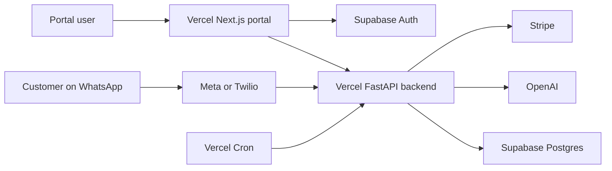

# System Architecture

## Topology

## Runtime Responsibilities

### `web/`

- handles portal rendering
- manages Supabase browser and SSR sessions
- forwards Supabase access tokens to the backend API

### `svmp/`

- verifies inbound provider webhooks
- writes and updates session state
- attempts best-effort inline Workflow B execution after debounce
- exposes internal batch routes for backlog draining and stale-session cleanup
- verifies Supabase JWTs for dashboard APIs
- owns billing session creation and Stripe webhook handling

### `supabase/`

- stores all durable runtime state in Postgres
- provides the Auth issuer, JWKS, and session-backed identity

## Workflow Model

1. Workflow A ingests inbound text into `session_state`.
2. Webhook intake waits until the latest debounce expiry for the ingested session set.
3. The backend attempts Workflow B inline for those session ids.
4. Vercel Cron continues to call `/internal/jobs/process-ready-sessions` as a backstop drain path.
5. Workflow C periodically closes stale sessions and writes closure governance logs.

## Trust Boundaries

- provider signatures are verified at webhook ingress
- tenant routing from provider payloads is resolved server-side
- portal bearer tokens are verified against Supabase JWKS
- tenant memberships and billing state are enforced server-side
- Stripe webhooks are verified and processed idempotently

## Deployment Model

- deploy `web/` and `svmp/` as separate Vercel projects
- keep Supabase as the shared production data plane
- use `svmp/vercel.json` for backend cron registration and function limits
- keep all secrets in Vercel project environment variables, not in repo config
