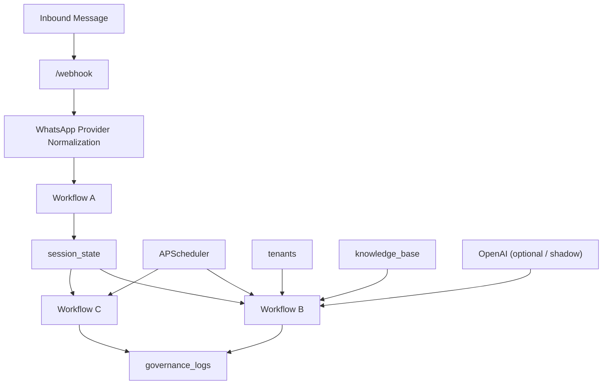

# SVMP System Architecture

## Purpose

SVMP is a governance and orchestration backend for AI-assisted customer support. The current implementation is a Mongo-first FastAPI service that:

- ingests inbound customer messages
- buffers fragmented messages into a session
- processes ready sessions on a scheduler
- retrieves tenant-scoped knowledge
- answers safely or escalates
- records a governance trail for every decision

This document describes the system as it exists in the codebase today.

## Repository Structure

### `svmp-core/`

The active product code lives here.

- `svmp_core/main.py`
  FastAPI app factory, startup lifecycle, scheduler registration
- `svmp_core/config.py`
  environment-backed runtime settings and fail-fast validation
- `svmp_core/routes/`
  HTTP entrypoints, currently centered on `/webhook`
- `svmp_core/workflows/`
  Workflow A, Workflow B, Workflow C
- `svmp_core/models/`
  typed internal models for webhook payloads, sessions, KB entries, and governance logs
- `svmp_core/core/`
  deterministic decision helpers for intent, domain routing, similarity, escalation, and governance log building
- `svmp_core/db/`
  database interfaces and Mongo implementation
- `svmp_core/integrations/`
  OpenAI client wrapper and WhatsApp provider abstraction

### `scripts/`

Operational/demo scripts.

- `seed_tenant.py`
- `seed_knowledge_base.py`
- `verify_live_runtime.py`
- `demo_data/sample_tenant.json`
- `demo_data/sample_kb.json`

### `svmp-platform/`

Reserved for a future platform/SaaS wrapper. It is not the active implementation path right now.

## Architecture Summary



## Runtime Components

## FastAPI Application

`svmp_core/main.py` creates the application and wires runtime dependencies.

Startup behavior:

- loads cached settings from `.env`
- calls `validate_runtime()` and fails fast if required configuration is missing
- configures logging
- connects MongoDB
- registers scheduler jobs for Workflow B and Workflow C
- starts the scheduler

HTTP endpoints:

- `GET /health`
- `GET /webhook`
- `POST /webhook`

## Scheduler

The runtime uses `AsyncIOScheduler`.

Registered jobs:

- Workflow B
  interval job, default every `1` second
- Workflow C
  interval job, default every `24` hours

These jobs are registered only once at boot and shut down with the app lifecycle.

## Environment and Runtime Contract

Settings are defined in `svmp_core/config.py` and loaded from the repo-root `.env`.

### Core App Settings

- `APP_NAME`
- `APP_ENV`
- `LOG_LEVEL`
- `PORT`

### Mongo Settings

- `MONGODB_URI`
- `MONGODB_DB_NAME`
- `MONGODB_SESSION_COLLECTION`
- `MONGODB_KB_COLLECTION`
- `MONGODB_GOVERNANCE_COLLECTION`
- `MONGODB_TENANTS_COLLECTION`

### OpenAI Settings

- `OPENAI_API_KEY`
- `EMBEDDING_MODEL`
- `LLM_MODEL`
- `USE_OPENAI_MATCHER`
- `OPENAI_SHADOW_MODE`
- `OPENAI_MATCHER_CANDIDATE_LIMIT`

### WhatsApp Settings

- `WHATSAPP_PROVIDER`
- `WHATSAPP_TOKEN`
- `WHATSAPP_PHONE_NUMBER_ID`
- `WHATSAPP_VERIFY_TOKEN`

### Workflow Settings

- `DEBOUNCE_MS`
- `SIMILARITY_THRESHOLD`
- `WORKFLOW_B_INTERVAL_SECONDS`
- `WORKFLOW_C_INTERVAL_HOURS`

### Fail-Fast Validation

Startup currently requires:

- `MONGODB_URI`
- `OPENAI_API_KEY`
- if `WHATSAPP_PROVIDER=meta`:
  - `WHATSAPP_TOKEN`
  - `WHATSAPP_PHONE_NUMBER_ID`
  - `WHATSAPP_VERIFY_TOKEN`

If `WHATSAPP_PROVIDER` is anything other than `meta` or `normalized`, startup fails.

## Messaging and Provider Layer

## Provider Abstraction

The provider interface is implemented in `svmp_core/integrations/whatsapp_provider.py`.

Current providers on this branch:

- `normalized`
  accepts already-normalized internal webhook payloads
- `meta`
  accepts raw Meta WhatsApp Business webhook JSON

There is also a normalized outbound interface:

- `OutboundTextMessage`
- `OutboundSendResult`

The Meta provider already has an outbound `send_text()` implementation using the Graph API. The current branch focuses on inbound normalization and runtime wiring; full live outbound verification is still a separate operational step.

## Webhook Route Behavior

`POST /webhook` now supports two input shapes:

### Normalized JSON

Used for local testing and internal smoke verification.

Example:

```json
{
  "tenantId": "Niyomilan",
  "clientId": "whatsapp",
  "userId": "9845891194",
  "text": "What does Niyomilan do?"
}
```

### Meta WhatsApp Webhook JSON

Used for provider-native ingestion.

Important:

- Meta payloads do not resolve tenant automatically yet
- provider-native requests therefore require:
  - `X-SVMP-Tenant-Id`
  - or `?tenantId=...`

The route normalizes Meta messages into the internal `WebhookPayload` shape before Workflow A.

### Verification

`GET /webhook` supports Meta webhook verification using:

- `hub.mode`
- `hub.verify_token`
- `hub.challenge`

## Current Inbound Schema

`WebhookPayload` is the canonical normalized inbound shape:

```json
{
  "tenantId": "Niyomilan",
  "clientId": "whatsapp",
  "userId": "9845891194",
  "text": "What does Niyomilan do?",
  "provider": "meta",
  "externalMessageId": "wamid..."
}
```

Field notes:

- `tenantId`
  real company identifier
- `clientId`
  source/channel identifier, currently typically `whatsapp`
- `userId`
  source-native end user identifier
- `provider`
  normalized source path such as `normalized` or `meta`
- `externalMessageId`
  provider-native message identifier when available

## Core Workflows

## Workflow A: Ingest and Debounce

Implemented in `svmp_core/workflows/workflow_a.py`.

Purpose:

- accept a normalized inbound message
- locate the active open session by `tenantId + clientId + userId`
- append the new message
- reset debounce timing

Behavior:

- trims and validates message text
- converts the inbound payload into an `IdentityFrame`
- creates a new `SessionState` if no active session exists
- otherwise appends the message to the existing session
- resets `debounceExpiresAt = now + DEBOUNCE_MS`
- forces `processing = false`

This is the buffering layer that collapses fragmented chat messages into one later processing unit.

## Workflow B: Process and Decide

Implemented in `svmp_core/workflows/workflow_b.py`.

Purpose:

- acquire one ready session
- merge messages into `combinedText`
- determine whether the system can answer safely
- write an immutable governance log
- close the processed session

High-level pipeline:

1. Acquire one ready session atomically.
2. Build `combinedText` from buffered fragments.
3. Load tenant metadata.
4. Infer intent.
5. Resolve domain.
6. Load active KB entries for the tenant/domain.
7. Run the matcher.
8. Apply the similarity gate.
9. Write `answered` or `escalated` governance log.
10. Close the session.

### Intent Routing

Intent classification is currently deterministic and keyword-based:

- `informational`
- `transactional`
- `escalate`

Non-informational queries are escalated immediately.

### Domain Routing

Domain selection is deterministic and based on keyword overlap against tenant domain metadata:

- `domainId`
- `name`
- `description`
- optional `keywords`

If no explicit match is found, Workflow B may fall back to the first valid tenant domain.

### Matching Strategy

The system currently supports two matchers:

- deterministic baseline matcher
- OpenAI matcher

#### Deterministic Baseline

The baseline matcher uses token overlap between the query and FAQ question text.

This is still the safe default authoritative matcher for the current demo path.

#### OpenAI Matcher

The OpenAI matcher ranks a limited candidate set and asks the configured model to return JSON with:

- `bestIndex`
- `similarityScore`
- `reason`

Supported runtime modes:

- `USE_OPENAI_MATCHER=false` and `OPENAI_SHADOW_MODE=true`
  OpenAI runs only for comparison; deterministic remains authoritative
- `USE_OPENAI_MATCHER=true`
  OpenAI becomes authoritative when the call succeeds

If OpenAI fails, Workflow B falls back cleanly to deterministic matching and records the failure in governance metadata.

### Similarity Gate

The final decision is made through `evaluate_similarity()`:

- if no candidate exists: escalate
- if `score >= threshold`: answer
- if `score < threshold`: escalate

Threshold resolution:

- prefer `tenants.settings.confidenceThreshold`
- fall back to global `SIMILARITY_THRESHOLD`

## Workflow C: Cleanup

Implemented in `svmp_core/workflows/workflow_c.py`.

Purpose:

- remove stale sessions
- optionally write closure governance logs for sessions that can be enumerated

The Mongo implementation currently supports deletion of stale sessions and the workflow is wired on a 24-hour interval.

## Data Model and Schemas

## `session_state`

Mutable active conversation state.

```json
{
  "_id": "ObjectId",
  "tenantId": "Niyomilan",
  "clientId": "whatsapp",
  "userId": "9845891194",
  "status": "open",
  "processing": false,
  "messages": [
    {
      "text": "What does Niyomilan do?",
      "at": "2026-03-30T11:45:00Z"
    }
  ],
  "createdAt": "ISODate",
  "updatedAt": "ISODate",
  "debounceExpiresAt": "ISODate"
}
```

## `knowledge_base`

Tenant-scoped FAQ corpus.

```json
{
  "_id": "faq-about-company",
  "tenantId": "Niyomilan",
  "domainId": "general",
  "question": "What does Niyomilan do?",
  "answer": "Niyomilan helps businesses automate tier-1 customer support across channels like WhatsApp.",
  "tags": ["about", "company"],
  "active": true,
  "createdAt": "ISODate",
  "updatedAt": "ISODate"
}
```

## `tenants`

Tenant metadata, routing config, and domain definitions.

```json
{
  "tenantId": "Niyomilan",
  "domains": [
    {
      "domainId": "general",
      "name": "General",
      "description": "Questions about the company, support system, contact info, and policies",
      "keywords": ["what", "company", "contact", "support", "hours", "policy"]
    }
  ],
  "tags": ["demo", "whatsapp"],
  "settings": {
    "confidenceThreshold": 0.75
  },
  "contactInfo": {
    "email": "demo@niyomilan.example",
    "phone": "+910000000000"
  }
}
```

## `governance_logs`

Immutable audit trail.

```json
{
  "_id": "ObjectId",
  "tenantId": "Niyomilan",
  "clientId": "whatsapp",
  "userId": "9845891194",
  "decision": "answered",
  "similarityScore": 1.0,
  "combinedText": "What does Niyomilan do?",
  "answerSupplied": "Niyomilan helps businesses automate tier-1 customer support across channels like WhatsApp.",
  "timestamp": "ISODate",
  "metadata": {}
}
```

`metadata` is intentionally extensible. Current Workflow B metadata can include:

- `domainId`
- `matcherMode`
- `matcherUsed`
- `matcherComparison.deterministic`
- `matcherComparison.openai`

## MongoDB Persistence and Indexes

Mongo persistence is implemented in `svmp_core/db/mongo.py`.

Repositories:

- `MongoSessionStateRepository`
- `MongoKnowledgeBaseRepository`
- `MongoGovernanceLogRepository`
- `MongoTenantRepository`

Current indexes:

- `session_state`
  - unique identity index on `tenantId + clientId + userId`
  - readiness index on `processing + debounceExpiresAt`
- `knowledge_base`
  - lookup index on `tenantId + domainId + active`
- `governance_logs`
  - lookup index on `tenantId + timestamp`
- `tenants`
  - unique partial index on `tenantId`

The tenant index is partial so legacy documents without `tenantId` do not block startup index creation.

## Build and Verification Scripts

## Seed Scripts

### `scripts/seed_tenant.py`

Loads `sample_tenant.json` and upserts the demo tenant.

### `scripts/seed_knowledge_base.py`

Loads `sample_kb.json` and reseeds the tenant/domain slice before inserting the current demo entries. This keeps old malformed demo rows from lingering in Atlas and breaking Workflow B.

## Live Verification Script

### `scripts/verify_live_runtime.py`

This script performs a real-stack smoke check:

1. loads settings
2. connects Mongo
3. runs Workflow A with a sample inbound payload
4. runs Workflow B against the stored session
5. prints:
   - session id
   - Workflow B result
   - latest governance log

This is the best current end-to-end verification path short of a live Meta webhook callback.

## Current Feature Set

- Mongo-first persistence
- fail-fast environment validation
- provider-aware webhook intake
- normalized internal inbound schema
- Meta webhook verification
- tenant-scoped session buffering
- deterministic intent routing
- deterministic domain routing
- deterministic FAQ matching
- OpenAI matcher in shadow or authoritative mode
- immutable governance logging
- repeatable demo seed scripts
- automated tests across config, app boot, DB adapter, workflows, webhook route, and smoke paths

## Current Operational Status

Verified in the current build:

- automated test suite for the implemented scope
- Atlas-backed tenant and KB seeding
- live Workflow A to Workflow B to governance flow
- deterministic answering path
- OpenAI fallback behavior when the API key is absent

Not fully verified in the current branch/runtime yet:

- live OpenAI matcher with a configured real API key
- live Meta webhook delivery from Meta infrastructure into the running service
- full production-grade outbound WhatsApp send loop

## Known Constraints and Design Gaps

### Tenant Resolution At Ingress

The core system is tenant-aware, but provider-native webhook requests do not auto-resolve tenant identity yet.

Current behavior:

- normalized internal payloads include `tenantId`
- Meta-native payloads require `X-SVMP-Tenant-Id` or `?tenantId=...`

This is acceptable for demoing and local verification, but a production multi-tenant ingress layer should derive tenant from provider account or phone-number mapping instead of requiring a manual header.

### Matching Maturity

The deterministic matcher is intentionally simple and safe. It is suitable for the current demo path but is not the final retrieval strategy.

The OpenAI matcher is already integrated behind flags, which allows:

- shadow comparison before rollout
- controlled switchover to model authority
- safe fallback on failure

### Legacy Data Tolerance

The recent live verification surfaced two real-world hardening needs that are now accounted for:

- tenant unique index ignores legacy docs missing `tenantId`
- KB seeding replaces the seeded tenant/domain slice so malformed legacy demo data does not poison runtime reads

## Recommended Verification Sequence

1. Run automated tests.
2. Seed tenant data.
3. Seed knowledge-base data.
4. Run `verify_live_runtime.py`.
5. Start the app with `uvicorn`.
6. Verify Meta webhook challenge.
7. Send a normalized local webhook request.
8. Send a Meta-style webhook payload.
9. Inspect Mongo collections and governance metadata.

## Summary

SVMP is currently a working Mongo-backed orchestration core for customer-support automation. The implementation is no longer just scaffolding: it has a real env contract, a real database adapter, a live webhook surface, a provider abstraction, scheduled processing workflows, repeatable demo data seeding, and a governance trail.

The current branch is best described as:

- code-first
- Mongo-first
- Meta WhatsApp capable
- deterministic by default
- OpenAI shadow-capable
- tenant-aware in core logic
- still awaiting fully automatic tenant resolution and complete live external-integration verification
