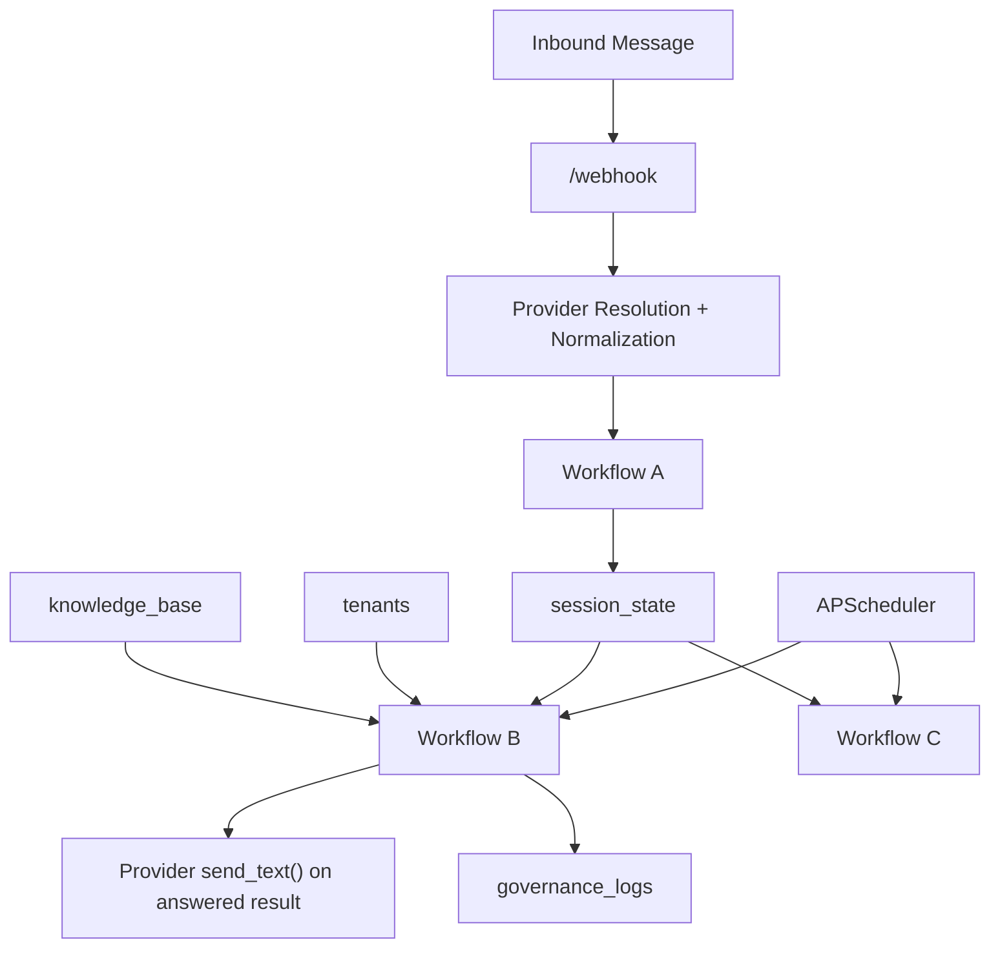

# SVMP System Architecture

## Purpose

SVMP is a Mongo-backed FastAPI orchestration service for AI-assisted customer support. In the current repo state, it:

- accepts inbound WhatsApp messages through a provider-aware webhook layer
- buffers fragmented customer input into a tenant-scoped session
- processes ready sessions on a scheduler
- retrieves tenant-scoped FAQ knowledge from MongoDB
- decides whether to answer or escalate
- writes a governance log for each decision
- sends answered responses back out through the active WhatsApp provider

This document reflects the code as it exists in the repository right now.

## Repository Structure

### `svmp-core/`

The active product code lives here.

- `svmp_core/main.py`
  FastAPI app factory, startup lifecycle, scheduler registration
- `svmp_core/config.py`
  env-backed settings and fail-fast validation
- `svmp_core/routes/`
  HTTP entrypoints, currently centered on `/webhook`
- `svmp_core/workflows/`
  Workflow A, Workflow B, Workflow C
- `svmp_core/models/`
  typed models for webhook payloads, sessions, KB entries, governance logs, and outbound sends
- `svmp_core/core/`
  deterministic helpers for intent routing, domain routing, similarity evaluation, escalation, and governance log construction
- `svmp_core/db/`
  persistence contracts and Mongo implementation
- `svmp_core/integrations/`
  OpenAI client wrapper plus WhatsApp provider adapters

### `scripts/`

Operational/demo scripts.

- `seed_tenant.py`
- `seed_knowledge_base.py`
- `verify_live_runtime.py`
- `demo_data/sample_tenant.json`
- `demo_data/sample_kb.json`

### `svmp-platform/`

Reserved for a future platform/SaaS layer. It is not the active implementation path.

## Architecture Summary



## Runtime Components

## FastAPI Application

`svmp_core/main.py` creates the application and wires runtime dependencies.

Startup behavior:

- loads settings from the repo-root `.env`
- calls `validate_runtime()` and fails fast if required values are missing
- configures logging
- connects MongoDB
- registers scheduler jobs for Workflow B and Workflow C
- starts the scheduler

HTTP endpoints:

- `GET /health`
- `GET /webhook`
- `POST /webhook`

## Scheduler

The runtime uses `AsyncIOScheduler`.

Registered jobs:

- Workflow B
  interval job, default every `1` second
- Workflow C
  interval job, default every `24` hours

These jobs are registered once at boot and shut down with the app lifecycle.

## Environment and Runtime Contract

Settings are defined in `svmp_core/config.py` and loaded from the repo-root `.env`.

### Core App Settings

- `APP_NAME`
- `APP_ENV`
- `LOG_LEVEL`
- `PORT`

### Mongo Settings

- `MONGODB_URI`
- `MONGODB_DB_NAME`
- `MONGODB_SESSION_COLLECTION`
- `MONGODB_KB_COLLECTION`
- `MONGODB_GOVERNANCE_COLLECTION`
- `MONGODB_TENANTS_COLLECTION`

### OpenAI Settings

- `OPENAI_API_KEY`
- `EMBEDDING_MODEL`
- `LLM_MODEL`
- `USE_OPENAI_MATCHER`
- `OPENAI_SHADOW_MODE`
- `OPENAI_MATCHER_CANDIDATE_LIMIT`

Important current-state note:

- these settings exist in config
- the OpenAI client wrapper exists
- but the current `workflow_b.py` on this branch is deterministic and does not use the OpenAI matcher path

### WhatsApp Settings

- `WHATSAPP_PROVIDER`
- `WHATSAPP_TOKEN`
- `WHATSAPP_PHONE_NUMBER_ID`
- `WHATSAPP_VERIFY_TOKEN`
- `TWILIO_ACCOUNT_SID`
- `TWILIO_AUTH_TOKEN`
- `TWILIO_WHATSAPP_NUMBER`

### Workflow Settings

- `DEBOUNCE_MS`
- `SIMILARITY_THRESHOLD`
- `WORKFLOW_B_INTERVAL_SECONDS`
- `WORKFLOW_C_INTERVAL_HOURS`

### Fail-Fast Validation

Startup currently requires:

- `MONGODB_URI`
- `OPENAI_API_KEY`
- if `WHATSAPP_PROVIDER=meta`:
  - `WHATSAPP_TOKEN`
  - `WHATSAPP_PHONE_NUMBER_ID`
  - `WHATSAPP_VERIFY_TOKEN`
- if `WHATSAPP_PROVIDER=twilio`:
  - `TWILIO_ACCOUNT_SID`
  - `TWILIO_AUTH_TOKEN`
  - `TWILIO_WHATSAPP_NUMBER`

Allowed providers:

- `meta`
- `twilio`
- `normalized`

## Messaging and Provider Layer

## Provider Abstraction

The provider interface is implemented in `svmp_core/integrations/whatsapp_provider.py`.

Current providers:

- `normalized`
  accepts already-normalized internal webhook payloads and simulates outbound sends
- `meta`
  accepts raw Meta WhatsApp Business webhook JSON and sends outbound messages through the Graph API
- `twilio`
  accepts Twilio `application/x-www-form-urlencoded` webhook posts and sends outbound messages through the Twilio Messages API

Normalized outbound models:

- `OutboundTextMessage`
- `OutboundSendResult`

## Webhook Route Behavior

`POST /webhook` supports three effective intake modes:

### Normalized JSON

Used for local testing and smoke verification.

Example:

```json
{
  "tenantId": "Niyomilan",
  "clientId": "whatsapp",
  "userId": "9845891194",
  "text": "What does Niyomilan do?"
}
```

### Meta WhatsApp Webhook JSON

Used for provider-native Meta ingestion.

Important:

- Meta payloads do not resolve tenant automatically yet
- provider-native requests therefore require:
  - `X-SVMP-Tenant-Id`
  - or `?tenantId=...`

### Twilio Form Payload

Used for provider-native Twilio sandbox/live ingestion.

Important:

- Twilio payloads also do not auto-resolve tenant yet
- requests therefore require:
  - `X-SVMP-Tenant-Id`
  - or `?tenantId=...`
- in practice, the Twilio sandbox webhook is configured with:
  - `/webhook?tenantId=<tenant>&provider=twilio`

### Verification

`GET /webhook` supports provider verification only where the provider implements it:

- Meta verification uses:
  - `hub.mode`
  - `hub.verify_token`
  - `hub.challenge`
- Twilio does not use this GET verification path and returns `405`

### Current Response Shape

Successful webhook intake currently returns:

```json
{
  "status": "accepted",
  "sessionId": "..."
}
```

## Current Inbound Schema

`WebhookPayload` is the canonical normalized inbound shape:

```json
{
  "tenantId": "Niyomilan",
  "clientId": "whatsapp",
  "userId": "9845891194",
  "text": "What does Niyomilan do?",
  "provider": "twilio",
  "externalMessageId": "SM..."
}
```

Field notes:

- `tenantId`
  company / tenant identifier
- `clientId`
  source channel identifier, currently typically `whatsapp`
- `userId`
  source-native end user identifier
- `provider`
  source path such as `normalized`, `meta`, or `twilio`
- `externalMessageId`
  provider-native message id when available

## Core Workflows

## Workflow A: Ingest and Debounce

Implemented in `svmp_core/workflows/workflow_a.py`.

Purpose:

- accept a normalized inbound message
- locate the identity session by `tenantId + clientId + userId`
- create or update that session
- append the message
- reset debounce timing
- clear the processing latch

Behavior:

- trims and validates message text
- converts the inbound payload into an `IdentityFrame`
- creates a new `SessionState` if no identity session exists
- otherwise appends the message to the existing identity session
- forces `status = "open"`
- resets `debounceExpiresAt = now + DEBOUNCE_MS`
- forces `processing = false`

This is the buffering layer that collapses fragmented chat input into one later processing unit.

## Workflow B: Process, Decide, and Send

Implemented in `svmp_core/workflows/workflow_b.py`.

Purpose:

- acquire one ready session atomically
- merge buffered messages into `combinedText`
- determine whether the system can answer safely
- send the answer through the active WhatsApp provider when one is available
- write an immutable governance log

High-level pipeline:

1. Acquire one ready session where:
   - `status = open`
   - `processing = false`
   - `debounceExpiresAt <= now`
2. Atomically flip `processing = true`.
3. Build `combinedText` from buffered fragments.
4. Load tenant metadata.
5. Infer intent.
6. Resolve domain.
7. Load active KB entries for the tenant/domain.
8. Run deterministic FAQ matching.
9. Apply the similarity gate.
10. If answered:
    - send the answer through the active provider
    - write an answered governance log with delivery metadata
11. If not answered:
    - write an escalated governance log

### Atomic Locking and Session Lifecycle

Current session state machine:

- Workflow A sets `processing = false` whenever new input arrives
- Workflow B acquires one ready session and sets `processing = true`
- Workflow B does not clear the latch after processing
- Workflow B does not close the session
- the next inbound message through Workflow A reopens that identity session for processing by setting `processing = false`
- Workflow C is the only cleanup path

This means the same identity session is reused across messages instead of create-close-create cycling.

### Intent Routing

Intent classification is deterministic and keyword-based:

- `informational`
- `transactional`
- `escalate`

Non-informational queries are escalated immediately.

### Domain Routing

Domain selection is deterministic and based on keyword overlap against tenant domain metadata:

- `domainId`
- `name`
- `description`
- optional `keywords`

If no explicit match is found, Workflow B may fall back to the first valid tenant domain.

### Matching Strategy

The current `workflow_b.py` on this branch uses a deterministic token-overlap FAQ matcher.

It compares query tokens against FAQ question tokens and selects the strongest match.

### Similarity Gate

The final decision is made through `evaluate_similarity()`:

- if no candidate exists: escalate
- if `score >= threshold`: answer
- if `score < threshold`: escalate

Threshold resolution:

- prefer `tenants.settings.confidenceThreshold`
- fall back to global `SIMILARITY_THRESHOLD`

### Outbound Send Behavior

When Workflow B answers:

- it resolves the active provider from `WHATSAPP_PROVIDER`
- builds an `OutboundTextMessage`
- calls provider `send_text()`
- stores delivery metadata in the answered governance log

If the outbound provider call fails:

- Workflow B raises
- the processing latch remains set
- new inbound input through Workflow A is required to reset `processing = false`

## Workflow C: Cleanup

Implemented in `svmp_core/workflows/workflow_c.py`.

Purpose:

- identify stale sessions when the repository supports stale-session listing
- optionally write closure governance logs
- delete stale sessions

Important current-state note:

- the workflow supports closure-log creation when `list_stale_sessions()` exists
- the Mongo repository currently exposes deletion but not stale-session enumeration
- so in the Mongo runtime today, stale sessions are deleted but closure logs are not written by default

## Data Model and Schemas

## `session_state`

Mutable active conversation state.

```json
{
  "_id": "ObjectId",
  "tenantId": "Niyomilan",
  "clientId": "whatsapp",
  "userId": "9845891194",
  "status": "open",
  "processing": false,
  "messages": [
    {
      "text": "What does Niyomilan do?",
      "at": "2026-03-30T11:45:00Z"
    }
  ],
  "createdAt": "ISODate",
  "updatedAt": "ISODate",
  "debounceExpiresAt": "ISODate"
}
```

Notes:

- identity is unique on `tenantId + clientId + userId`
- the same identity doc is reused across inbound messages

## `knowledge_base`

Tenant-scoped FAQ corpus.

```json
{
  "_id": "faq-about-company",
  "tenantId": "Niyomilan",
  "domainId": "general",
  "question": "What does Niyomilan do?",
  "answer": "Niyomilan helps businesses automate tier-1 customer support across channels like WhatsApp.",
  "tags": ["about", "company"],
  "active": true,
  "createdAt": "ISODate",
  "updatedAt": "ISODate"
}
```

## `tenants`

Tenant metadata, routing config, and domain definitions.

```json
{
  "tenantId": "Niyomilan",
  "domains": [
    {
      "domainId": "general",
      "name": "General",
      "description": "Questions about the company, support system, contact info, and policies",
      "keywords": ["what", "company", "contact", "support", "hours", "policy"]
    }
  ],
  "tags": ["demo", "whatsapp"],
  "settings": {
    "confidenceThreshold": 0.75
  },
  "contactInfo": {
    "email": "demo@niyomilan.example",
    "phone": "+910000000000"
  }
}
```

## `governance_logs`

Immutable audit trail.

```json
{
  "_id": "ObjectId",
  "tenantId": "Niyomilan",
  "clientId": "whatsapp",
  "userId": "9845891194",
  "decision": "answered",
  "similarityScore": 1.0,
  "combinedText": "What does Niyomilan do?",
  "answerSupplied": "Niyomilan helps businesses automate tier-1 customer support across channels like WhatsApp.",
  "timestamp": "ISODate",
  "metadata": {
    "domainId": "general",
    "delivery": {
      "provider": "twilio",
      "status": "accepted",
      "externalMessageId": "SM..."
    }
  }
}
```

`metadata` is intentionally extensible. In the current answered flow it includes:

- `domainId`
- `delivery.provider`
- `delivery.status`
- `delivery.externalMessageId`

## MongoDB Persistence and Indexes

Mongo persistence is implemented in `svmp_core/db/mongo.py`.

Repositories:

- `MongoSessionStateRepository`
- `MongoKnowledgeBaseRepository`
- `MongoGovernanceLogRepository`
- `MongoTenantRepository`

Current indexes:

- `session_state`
  - unique identity index on `tenantId + clientId + userId`
  - readiness index on `processing + debounceExpiresAt`
- `knowledge_base`
  - lookup index on `tenantId + domainId + active`
- `governance_logs`
  - lookup index on `tenantId + timestamp`
- `tenants`
  - unique partial index on `tenantId`

The tenant index is partial so legacy documents without `tenantId` do not block startup index creation.

## Build and Verification Scripts

## Seed Scripts

### `scripts/seed_tenant.py`

Loads `sample_tenant.json` and upserts the demo tenant.

### `scripts/seed_knowledge_base.py`

Loads `sample_kb.json` and resets each seeded tenant/domain slice before inserting the current sample corpus. This prevents stale malformed demo rows from lingering in Atlas and breaking Workflow B.

## Live Verification Script

### `scripts/verify_live_runtime.py`

This script exists to perform a real-stack Workflow A/B check against the configured runtime.

Important current-state note:

- the script is present in the repo
- but its printed result contract is behind current `WorkflowBResult`
- it still references matcher-oriented fields that are not on the current deterministic Workflow B result

So the script should be treated as implementation drift that needs refresh before it is relied on again.

## Current Feature Set

- Mongo-first persistence
- fail-fast env validation
- provider-aware webhook intake
- normalized internal inbound schema
- Meta webhook verification
- Meta outbound send support
- Twilio inbound webhook normalization
- Twilio outbound send support
- tenant-scoped session buffering
- deterministic intent routing
- deterministic domain routing
- deterministic FAQ matching
- outbound reply sending for answered results
- immutable governance logging
- repeatable tenant and KB seed scripts
- automated tests across config, app boot, DB adapter, workflows, webhook route, provider adapters, and smoke flows

## Current Operational Status

Verified in the current branch/runtime:

- automated tests for the implemented scope
- Atlas-backed tenant seeding
- Atlas-backed KB seeding
- live Workflow A to Workflow B processing
- live Twilio Sandbox inbound webhook delivery
- live deterministic answer selection
- live outbound Twilio WhatsApp reply delivery
- atomic session lock behavior with repeated inbound messages from the same user

Not fully verified in the current repo state:

- live Meta outbound/inbound verification against Meta infrastructure
- OpenAI-driven matching inside the current `workflow_b.py`
- automatic tenant resolution from provider account / sender mapping

## Known Constraints and Design Gaps

### Tenant Resolution at Ingress

The core logic is tenant-aware, but provider-native webhook requests do not auto-resolve tenant identity yet.

Current behavior:

- normalized internal payloads include `tenantId`
- Meta-native payloads require `X-SVMP-Tenant-Id` or `?tenantId=...`
- Twilio-native payloads also require `X-SVMP-Tenant-Id` or `?tenantId=...`

This is acceptable for demos and local verification, but a production multi-tenant ingress layer should derive tenant from provider account or phone-number mapping.

### OpenAI Drift

The repo still contains:

- OpenAI settings
- the OpenAI integration wrapper
- matcher-related config flags

But the current `workflow_b.py` on this branch is deterministic-only. So the configuration surface is ahead of the active runtime implementation.

### Outbound Failure Handling

Answered outbound sends are now part of Workflow B.

Current behavior:

- successful sends are recorded in governance metadata
- failed sends raise and bubble through Workflow B
- the processing latch stays set until new inbound input arrives

That is consistent with the current lock model, but operationally it means outbound failures can leave a session latched until the next user message.

### Stale-Session Cleanup Logging

Workflow C can write closure logs only when stale sessions can be enumerated before deletion.

The Mongo adapter currently supports deletion but not stale-session listing, so stale Mongo sessions are cleaned up without detailed closure-log generation.

## Recommended Verification Sequence

1. Run automated tests.
2. Seed tenant data.
3. Seed knowledge-base data.
4. Start the app with `uvicorn`.
5. Verify a normalized local webhook request.
6. Verify a Meta-style payload if needed.
7. For Twilio demo verification:
   - start a public tunnel
   - point Twilio Sandbox webhook to `/webhook?tenantId=<tenant>&provider=twilio`
   - send a WhatsApp message from a sandbox-joined phone
8. Confirm session state and governance logs in Mongo.
9. Confirm the answer is delivered back to WhatsApp when the query is answered.

## Summary

SVMP is currently a working Mongo-backed orchestration core for customer-support automation with a provider-aware webhook layer and a live Twilio sandbox demo path.

The current branch is best described as:

- code-first
- Mongo-first
- deterministic in Workflow B
- provider-aware for normalized, Meta, and Twilio intake
- capable of outbound WhatsApp replies through Meta or Twilio providers
- tenant-aware in core logic
- still awaiting automatic tenant resolution and a cleanup pass on stale OpenAI-era config/script drift
